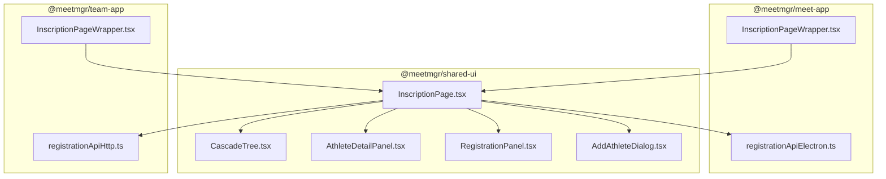
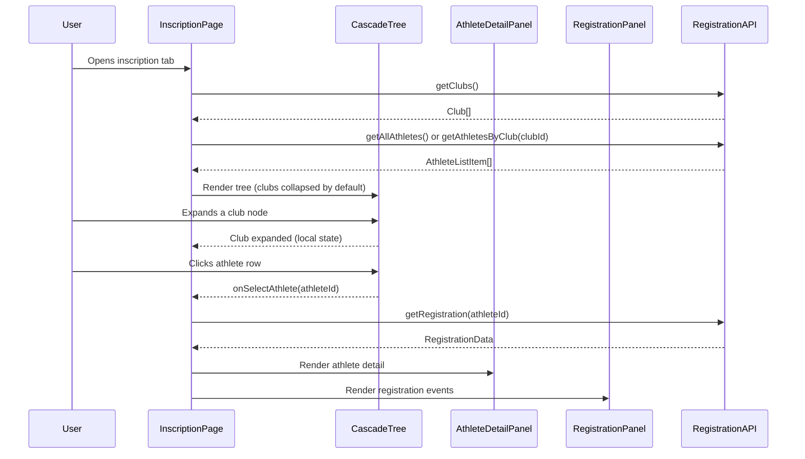
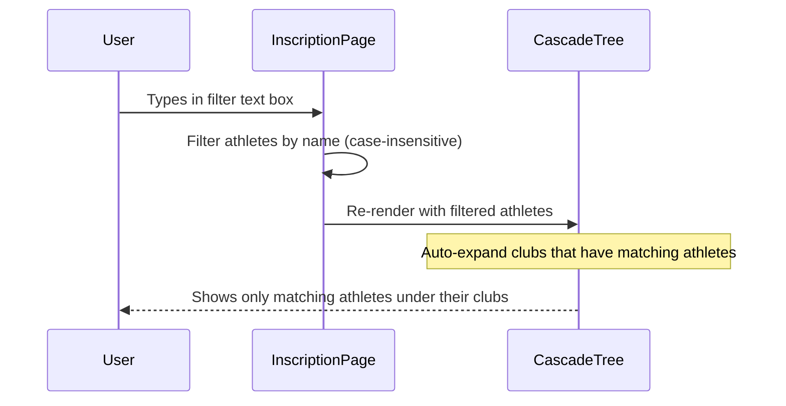
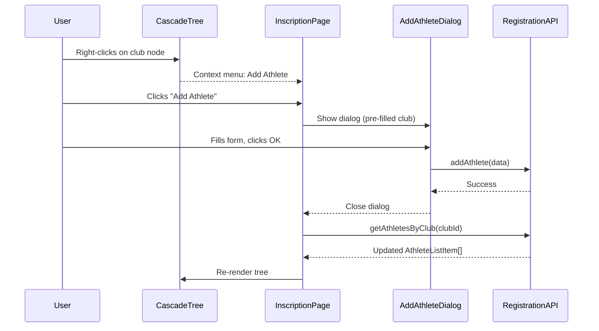

# Design Document: Inscription Page Refactor

## Overview

This feature refactors the inscription (registration) page in both the meet-app and team-app to align with the look and feel of the meet page (HeatsPage/EventsPage). The current implementation uses a flat table layout with a club dropdown filter and a separate registration detail page. The new design introduces a cascade (collapsible tree) layout with clubs as parent nodes and athletes as child nodes, a text filter for athlete names across all clubs, athlete detail and registration boxes below the cascade, and add/delete athlete actions via context menus within the cascade. Additionally, all existing cascade lists in the application will be fixed to open in a collapsed (not-expanded) state by default. In the team-app, when a team coach is logged in, only their club is shown in the cascade.

The refactored page follows the same split-panel pattern used in HeatsPage: a collapsible tree in the top portion and a detail/editing panel in the bottom portion. This creates visual consistency across the application.

## Architecture



## Sequence Diagrams

### Main Flow: Page Load and Athlete Selection



### Filter Flow



### Add/Delete Athlete Flow



## Components and Interfaces

### Component 1: InscriptionPage (shared-ui)

**Purpose**: Main page component that orchestrates the cascade tree, athlete detail panel, and registration panel. Replaces the current AthletesListPage + RegistrationPage two-page navigation with a single unified view.

**Interface**:
```typescript
interface InscriptionPageProps {
  role: string           // 'admin' | 'coach' | 'organizer'
  clubId?: string        // Pre-filter to single club (team-app coach mode)
  refreshKey?: number    // Trigger re-fetch
}
```

**Responsibilities**:
- Fetches clubs and athletes from RegistrationAPI
- Manages selected athlete state
- Coordinates filter text across the cascade tree
- Handles add/delete athlete actions
- Renders the split-panel layout (cascade top, detail bottom)

### Component 2: CascadeTree (shared-ui)

**Purpose**: Collapsible tree component displaying clubs as parent nodes and athletes as child nodes. Follows the same expand/collapse pattern as HeatsPage sessions/events.

**Interface**:
```typescript
interface CascadeTreeProps {
  clubs: Club[]
  athletesByClub: Map<number, AthleteListItem[]>
  selectedAthleteId: number | null
  filterText: string
  defaultExpanded: boolean  // Always false per requirements
  onSelectAthlete: (athleteId: number) => void
  onAddAthlete: (clubId: number) => void
  onDeleteAthlete: (athleteId: number, name: string) => void
  role: string
}

interface CascadeTreeState {
  expandedClubs: Set<number>
  contextMenu: { x: number; y: number; clubId?: number; athleteId?: number } | null
}
```

**Responsibilities**:
- Renders collapsible club nodes with ▶/▼ indicators
- Renders athlete rows under each club
- Applies text filter: shows only matching athletes, auto-expands their parent clubs
- Provides right-click context menu for add/delete actions
- Highlights selected athlete row
- All nodes collapsed by default (not expanded)

### Component 3: AthleteDetailPanel (shared-ui)

**Purpose**: Displays and allows editing of the selected athlete's personal information. Equivalent to the current athlete header strip in RegistrationPage.

**Interface**:
```typescript
interface AthleteDetailPanelProps {
  athlete: RegistrationData['athlete'] | null
  athleteId: number
  onSave: (field: string, value: string) => void
}
```

**Responsibilities**:
- Shows editable fields: last name, first name, gender, birthdate, license/NRAN
- Inline editing with blur-to-save pattern
- Shows club name (read-only)

### Component 4: RegistrationPanel (shared-ui)

**Purpose**: Displays the event registration table (individual + relay events) for the selected athlete. Extracted from the current RegistrationPage's events content section.

**Interface**:
```typescript
interface RegistrationPanelProps {
  data: RegistrationData
  athleteId: number
  onRegister: (eventId: number, timeMs: number | null, ageCode: string) => void
  onUnregister: (regId: number) => void
  onUpdateEntryTime: (eventId: number, ageCode: string, timeMs: number | null) => void
}
```

**Responsibilities**:
- Category selector with age code dropdown
- Individual events table with checkboxes, best times, entry time inputs
- Relay events table with teammate selectors
- Handles registration/unregistration via callbacks

### Component 5: AddAthleteDialog (shared-ui)

**Purpose**: Modal dialog for adding a new athlete to a specific club. Replaces the inline form currently shown in AthletesListPage.

**Interface**:
```typescript
interface AddAthleteDialogProps {
  clubId: number
  clubName: string
  onConfirm: (data: NewAthleteData) => void
  onCancel: () => void
}

interface NewAthleteData {
  first_name: string
  last_name: string
  gender: string
  birthdate: string | null
  license: string
  club_id: number
}
```

**Responsibilities**:
- Modal overlay with form fields
- Validates required fields (first name, last name)
- Pre-fills club_id from context
- Follows the same dialog styling as other app dialogs (DbConfigDialog pattern)

## Data Models

### Existing Models (unchanged)

```typescript
// From shared-ui/src/data/api.ts - no changes needed
interface Club {
  id: number
  name: string
  athlete_count?: number
}

interface AthleteListItem {
  id: number
  first_name: string
  last_name: string
  gender: string
  birthdate: string
  license: string
}

interface RegistrationData {
  athlete: { first_name: string; last_name: string; gender: string; birthdate: string; license: string; club: string }
  individual_events: RegistrationStyle[]
  relay_events: RegistrationStyle[]
  club_athletes: Array<{ id: number; name: string }>
  suggested_age_code: string
  meet_course: string
  closure_date?: string | null
}
```

### New/Extended Models

```typescript
// Extended athlete list item to include club_id for grouping
interface AthleteWithClub extends AthleteListItem {
  club_id: number
}

// Page state model
interface InscriptionPageState {
  clubs: Club[]
  athletesByClub: Map<number, AthleteListItem[]>
  selectedAthleteId: number | null
  registrationData: RegistrationData | null
  filterText: string
  expandedClubs: Set<number>
  loading: boolean
  saving: boolean
}
```

**Validation Rules**:
- `filterText` is applied case-insensitively to `first_name + ' ' + last_name`
- When `role !== 'admin'` and `clubId` is provided, only that club's athletes are loaded
- `expandedClubs` starts as empty Set (all collapsed by default)

## Algorithmic Pseudocode

### Main Filtering Algorithm

```typescript
function filterAthletes(
  athletesByClub: Map<number, AthleteListItem[]>,
  filterText: string
): { filtered: Map<number, AthleteListItem[]>; autoExpandClubs: Set<number> } {
  // Precondition: athletesByClub is populated, filterText is trimmed
  
  if (!filterText) {
    return { filtered: athletesByClub, autoExpandClubs: new Set() }
  }

  const needle = filterText.toLowerCase()
  const filtered = new Map<number, AthleteListItem[]>()
  const autoExpandClubs = new Set<number>()

  for (const [clubId, athletes] of athletesByClub) {
    const matching = athletes.filter(a =>
      `${a.first_name} ${a.last_name}`.toLowerCase().includes(needle)
    )
    if (matching.length > 0) {
      filtered.set(clubId, matching)
      autoExpandClubs.add(clubId) // Auto-expand clubs with matches
    }
  }

  // Postcondition: filtered contains only clubs with matching athletes
  // Postcondition: autoExpandClubs contains IDs of clubs to force-expand
  return { filtered, autoExpandClubs }
}
```

### Cascade Expansion Logic

```typescript
function computeVisibleExpansion(
  expandedClubs: Set<number>,
  autoExpandClubs: Set<number>,
  filterText: string
): Set<number> {
  // When filter is active, auto-expanded clubs override manual state
  if (filterText) {
    return autoExpandClubs
  }
  // When no filter, use manual expansion state
  return expandedClubs
}
```

### Data Loading Strategy (Team-App Coach Mode)

```typescript
async function loadInscriptionData(
  api: RegistrationAPI,
  role: string,
  clubId?: string
): Promise<{ clubs: Club[]; athletesByClub: Map<number, AthleteListItem[]> }> {
  // Precondition: api is available, role is valid
  
  const clubs = await api.getClubs()
  const athletesByClub = new Map<number, AthleteListItem[]>()

  if (role !== 'admin' && clubId) {
    // Coach mode: only load their club
    const visibleClubs = clubs.filter(c => String(c.id) === clubId)
    for (const club of visibleClubs) {
      const athletes = await api.getAthletesByClub(String(club.id))
      athletesByClub.set(club.id, athletes)
    }
    return { clubs: visibleClubs, athletesByClub }
  }

  // Admin mode: load all clubs and their athletes
  for (const club of clubs) {
    const athletes = await api.getAthletesByClub(String(club.id))
    athletesByClub.set(club.id, athletes)
  }

  // Postcondition: athletesByClub has entries for all visible clubs
  return { clubs, athletesByClub }
}
```

## Key Functions with Formal Specifications

### Function 1: useInscriptionPage (custom hook)

```typescript
function useInscriptionPage(
  api: RegistrationAPI,
  role: string,
  clubId?: string
): InscriptionPageState & InscriptionPageActions
```

**Preconditions:**
- `api` is a valid RegistrationAPI implementation
- `role` is one of 'admin', 'coach', 'organizer'
- If `role !== 'admin'`, `clubId` must be provided

**Postconditions:**
- Returns current page state and action handlers
- State is consistent: if `selectedAthleteId` is set, `registrationData` is loaded or loading
- `athletesByClub` only contains clubs visible to the current role

**Loop Invariants:** N/A

### Function 2: handleAthleteSelect

```typescript
async function handleAthleteSelect(athleteId: number): Promise<void>
```

**Preconditions:**
- `athleteId` exists in one of the loaded clubs' athlete lists
- API is available

**Postconditions:**
- `selectedAthleteId` is set to `athleteId`
- `registrationData` is loaded for the selected athlete
- Detail panel and registration panel are rendered with the athlete's data

### Function 3: handleFilterChange

```typescript
function handleFilterChange(text: string): void
```

**Preconditions:**
- `text` is a string (may be empty)

**Postconditions:**
- `filterText` state is updated
- Cascade tree re-renders showing only matching athletes
- Clubs with matching athletes are auto-expanded
- If no matches, tree shows empty state
- Previously selected athlete remains selected (if still visible)

## Example Usage

```typescript
// In meet-app: InscriptionPageWrapper.tsx
import { RegistrationApiProvider } from '@shared/context/RegistrationApiContext'
import InscriptionPage from '@shared/pages/InscriptionPage'
import { registrationApiElectron } from '../registrationApiElectron'

export default function InscriptionPageWrapper({ refreshKey = 0 }: { refreshKey?: number }) {
  return (
    <RegistrationApiProvider api={registrationApiElectron}>
      <InscriptionPage
        key={refreshKey}
        role="admin"
      />
    </RegistrationApiProvider>
  )
}

// In team-app: main.jsx route
function InscriptionPageTeam() {
  const { lang } = useLang()
  return (
    <SharedLangProvider initialLang={lang}>
      <RegistrationApiProvider api={registrationApiHttp}>
        <InscriptionPage
          role={auth.role}
          clubId={auth.club_id}
        />
      </RegistrationApiProvider>
    </SharedLangProvider>
  )
}

// Usage in CascadeTree - collapsed by default
<CascadeTree
  clubs={clubs}
  athletesByClub={filteredAthletes}
  selectedAthleteId={selectedAthleteId}
  filterText={filterText}
  defaultExpanded={false}  // KEY: all cascades collapsed by default
  onSelectAthlete={handleAthleteSelect}
  onAddAthlete={handleAddAthlete}
  onDeleteAthlete={handleDeleteAthlete}
  role={role}
/>
```

## Correctness Properties

*A property is a characteristic or behavior that should hold true across all valid executions of a system — essentially, a formal statement about what the system should do. Properties serve as the bridge between human-readable specifications and machine-verifiable correctness guarantees.*

### Property 1: Cascade Default Collapsed

*For any* set of clubs provided to the CascadeTree component, the initial expanded state shall be an empty set — no club node is expanded on initial render.

**Validates: Requirements 1.2, 9.1, 9.2**

### Property 2: Filter Correctness

*For any* set of athletes across any number of clubs, and *for any* non-empty filter string, every athlete visible in the filtered cascade tree must have a full name (first_name + " " + last_name) that contains the filter text as a case-insensitive substring match. Additionally, no club with zero matching athletes shall be visible.

**Validates: Requirements 2.2, 2.4**

### Property 3: Coach Role Isolation

*For any* set of clubs and athletes, when the user role is "coach" and a clubId is provided, the visible clubs list shall contain exactly one club whose id matches the provided clubId, and no athletes from other clubs shall be present.

**Validates: Requirements 8.1, 8.2, 8.3**

### Property 4: Filter Auto-Expansion

*For any* non-empty filter text that produces matching athletes, every club that contains at least one matching athlete shall be included in the effective expanded clubs set.

**Validates: Requirements 2.3**

### Property 5: Filter Round-Trip

*For any* manual expansion state and *for any* filter text, applying the filter and then clearing it shall restore the original manual expansion state and show all athletes.

**Validates: Requirements 2.5**

### Property 6: Add Athlete Validation

*For any* input where first_name or last_name is empty or consists entirely of whitespace, the Add_Athlete_Dialog shall reject submission and not call the Registration_API.

**Validates: Requirements 6.3**

## Error Handling

### Error Scenario 1: API Failure on Load

**Condition**: `getClubs()` or `getAthletesByClub()` throws an error
**Response**: Show a centered error message with retry button
**Recovery**: User clicks retry, page re-fetches data

### Error Scenario 2: Delete Athlete with Registrations

**Condition**: User attempts to delete an athlete who has active registrations
**Response**: Show confirmation dialog warning about cascading deletion of registrations
**Recovery**: User confirms or cancels; if confirmed, API handles cascading delete

### Error Scenario 3: Registration API Unavailable

**Condition**: Network error during register/unregister operations
**Response**: Show inline error toast, revert optimistic UI update
**Recovery**: User retries the operation

### Error Scenario 4: Concurrent Modification

**Condition**: Another user modifies the same athlete's registrations
**Response**: On next data fetch, UI updates to reflect current state
**Recovery**: Automatic on next load/refresh

## Testing Strategy

### Unit Testing Approach

- Test `filterAthletes` function with various inputs (empty filter, partial match, no match, special characters)
- Test `computeVisibleExpansion` logic for filter vs manual expansion
- Test `loadInscriptionData` for admin vs coach role filtering
- Test CascadeTree rendering with different expansion states

### Property-Based Testing Approach

**Property Test Library**: vitest + fast-check

- Property: Filtering never produces athletes that don't match the filter text
- Property: Auto-expansion set is always a subset of clubs that have matching athletes
- Property: Coach mode never shows clubs other than the coach's club

### Integration Testing Approach

- Test full page flow: load → select athlete → view registration → register event
- Test filter interaction: type filter → verify tree updates → clear filter → verify restoration
- Test add/delete athlete: add via dialog → verify appears in tree → delete → verify removed

## Performance Considerations

- **Lazy loading athletes**: Load athletes per-club on expand rather than all at once (for meets with many clubs)
- **Debounced filter**: Apply 150ms debounce on filter text input to avoid excessive re-renders
- **Memoized filtering**: Use `useMemo` for the filtered athletes computation
- **Virtualization**: For clubs with 100+ athletes, consider virtualizing the athlete list within each club node (future optimization)

## Security Considerations

- **Role-based visibility**: Coach users must only see their own club's athletes (enforced both client-side via `clubId` prop and server-side via API)
- **Admin-only actions**: Reset PIN button only shown for admin role
- **Confirmation dialogs**: Destructive actions (delete athlete) require explicit confirmation

## Dependencies

- **Existing**: React 18, Tailwind CSS, @meetmgr/shared-ui, RegistrationAPI interface
- **No new dependencies required**: The cascade tree uses native HTML/CSS with Tailwind (same as HeatsPage/EventsPage tree implementation)
- **Shared patterns**: Follows the same expand/collapse Set-based state management as HeatsPage and EventsPage
