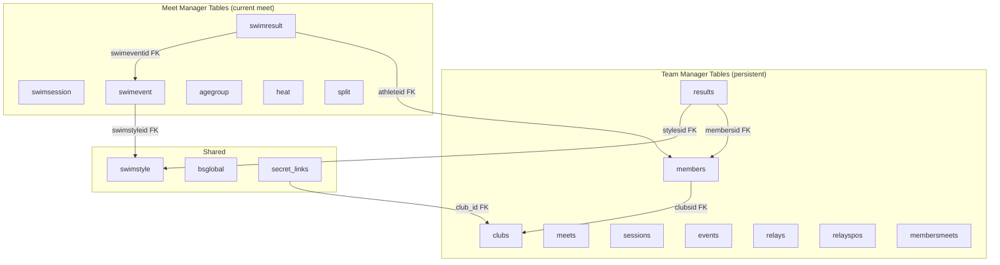
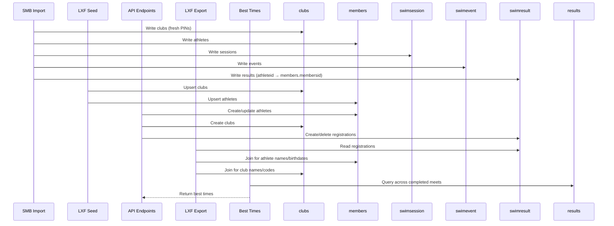

# Design Document: Remove Dual Schema

## Overview

This design eliminates the dual-write architecture by removing the old `club` and `athlete` tables and all code that references them. After this change, the system has exactly two table groups:

1. **Team Manager tables** — persistent cross-meet data (`clubs`, `members`, `meets`, `sessions`, `events`, `results`, `relays`, `relayspos`, `membersmeets`, `swimstyle`)
2. **Meet Manager tables** — current meet structure from SMB import (`swimsession`, `swimevent`, `agegroup`, `swimresult`, `heat`, `split`, `bsglobal`)

The `swimresult` table's `athleteid` column will reference `members.membersid` directly (FK change). All dual-write patterns are removed — each mutation writes to exactly one table group. No database migration is needed; the system deploys fresh via `docker compose down -v`.

## Architecture



### Data Flow After Migration



## Components and Interfaces

### 1. `models.py` — Meet Manager Schema (Simplified)

**Changes:** Remove `Club` and `Athlete` classes entirely. Keep `SwimStyle`, `BsGlobal`, `SecretLink`, `SwimSession`, `SwimEvent`, `AgeGroup`, `SwimResult`, `Heat`, `Split`, and helper constants/functions.

**`SwimResult.athleteid` FK change:**
```python
class SwimResult(Base):
    __tablename__ = "swimresult"
    # ...
    athleteid = Column(Integer, ForeignKey("members.membersid"))
    # Remove: athlete = relationship("Athlete", ...)
    member = relationship("Member", back_populates="swim_results")
```

The column name stays `athleteid` (not renamed to `membersid`) to minimize churn in code that references `reg.athleteid`. The FK target changes from `athlete.athleteid` to `members.membersid`.

### 2. `models_team.py` — Team Manager Schema (Unchanged)

No changes needed. The `Member` model gains a `swim_results` relationship:
```python
class Member(Base):
    # ... existing fields ...
    swim_results = relationship("SwimResult", back_populates="member", foreign_keys="SwimResult.athleteid")
```

### 3. `routers/api.py` — API Endpoints

**Removals:**
- All `from ..models import Club, Athlete` imports
- All dual-write blocks (marked with `# (transition)` comments)
- `Club` and `Athlete` queries in `delete_club`, `create_athlete`, `delete_athlete`, `update_athlete`
- `Result` (TeamResult) writes in `create_registration` and `delete_registration`

**Rewrites:**
- `create_registration`: Query `Member` instead of `Athlete` for ownership check; write only to `swimresult`
- `delete_registration`: Query `Member` for ownership check; delete only from `swimresult`
- `create_athlete`: Write only to `Member` (no parallel `Athlete` write)
- `delete_athlete`: Delete from `Member` and `SwimResult` only
- `update_athlete`: Update `Member` only (no sync to old `Athlete`)
- `create_club`: Write only to `TeamClub` (no parallel `Club` write)
- `delete_club`: Delete from `TeamClub`, `Member`, `SwimResult`, `SecretLink` only

### 4. `export.py` — Registrations LXF Export

**Changes:**
- Replace `from ..models import Club, Athlete` with `from ..models_team import TeamClub, Member`
- Replace `joinedload(SwimResult.athlete).joinedload(Athlete.club)` with `joinedload(SwimResult.member).joinedload(Member.club)`
- Update all attribute access: `reg.athlete` → `reg.member`, `ath.club` → `member.club`
- `ath.exception` → `member.handicapex`

### 5. `export_entries.py` — Entries LXF Export

**Changes:**
- Replace `Club` with `TeamClub`, `Athlete` with `Member`
- Query `TeamClub` with `joinedload(TeamClub.members)` instead of `Club` with `joinedload(Club.athletes)`
- Update attribute access throughout

### 6. `seed.py` — Entries LXF Import

**Changes:**
- Remove all `Club` and `Athlete` imports and usage
- Write directly to `TeamClub` and `Member` only
- Remove the dual-write blocks that create parallel rows
- Lookup existing clubs via `TeamClub` (already partially done)
- Lookup existing athletes via `Member`

### 7. `events.py` — Meet Upload (LXF)

**Changes:** Minimal — this file already writes to both schemas intentionally (creating `Meet`, `TeamSession`, `TeamEvent` alongside `SwimSession`, `SwimEvent`). This dual-write is correct because it populates both table groups for their distinct purposes. No changes needed.

### 8. `api.py` — SMB Import (`upload_meet_smb`)

**Changes:**
- Remove `db.add(Club(...))` block — write only to `TeamClub`
- Remove `db.add(Athlete(...))` block — write only to `Member`
- Remove `db.query(Club).delete()` and `db.query(Athlete).delete()` from the wipe section
- `SwimResult` rows keep their `athleteid` values from the SMB (which match `members.membersid` since we import athletes with the same IDs)

### 9. `invoices.py` — Stripe Invoice Generation

**Changes:**
- Replace `Club` with `TeamClub`, `Athlete` with `Member`
- Replace `Club.athletes` relationship with `TeamClub.members`
- Replace `Athlete.clubid` with `Member.clubsid`
- Replace `Athlete.athleteid` with `Member.membersid`
- Update all queries to use new model names

### 10. `best_times.py` — Legacy Best Times (JSON Blobs)

**Changes:**
- This module reads/writes `bsglobal` keys (`bt_{athlete_id}`) — no dependency on `Club`/`Athlete` tables
- The `get_best_time_date` function used by `export.py` queries `bsglobal` — no changes needed
- Consider deprecation note: this module will eventually be replaced entirely by `best_times_v2.py`

### 11. `best_times_v2.py` — New Best Times (No Changes)

Already reads from `results` table only. No dependency on old schema.

### 12. `combined_events.py` — Combined Events (No Changes)

Reads from `swimevent`, `agegroup`, `swimstyle` via raw SQL. No dependency on `Club`/`Athlete`.

### 13. `point_scores.py` — Point Scores (No Changes)

Reads from `agegroup` via raw SQL. No dependency on `Club`/`Athlete`.

## Data Models

### Tables Removed

| Table | Replacement |
|-------|-------------|
| `club` | `clubs` (TeamClub) |
| `athlete` | `members` (Member) |

### FK Change: `swimresult.athleteid`

| Before | After |
|--------|-------|
| `ForeignKey("athlete.athleteid")` | `ForeignKey("members.membersid")` |

### Relationship Changes

| Model | Old Relationship | New Relationship |
|-------|-----------------|------------------|
| `SwimResult` | `athlete = relationship("Athlete")` | `member = relationship("Member")` |
| `Member` | (none to swimresult) | `swim_results = relationship("SwimResult")` |

### ID Alignment Strategy

The system maintains ID alignment between `members.membersid` and `swimresult.athleteid` through:
- **SMB import**: Athletes are inserted into `members` with the same IDs from the SMB file. `swimresult` rows reference these same IDs.
- **LXF seed**: Athletes get auto-generated IDs in `members`. Registrations reference these IDs.
- **API creation**: `Member` gets an auto-increment ID. Registrations use `member.membersid`.

### Unique Constraint Update

`SwimResult` has a unique constraint:
```python
UniqueConstraint("athleteid", "swimeventid", "age_code", name="uq_swimresult_entry")
```
This remains valid — `athleteid` still uniquely identifies an athlete (now pointing to `members`).

## Correctness Properties

*A property is a characteristic or behavior that should hold true across all valid executions of a system — essentially, a formal statement about what the system should do. Properties serve as the bridge between human-readable specifications and machine-verifiable correctness guarantees.*

### Property 1: Export Athlete Data Matches Members Table

*For any* set of members with clubs and swimresult registrations, the LXF export SHALL produce XML where each athlete's firstname, lastname, birthdate, gender, and club code match the corresponding `members` and `clubs` table data exactly.

**Validates: Requirements 2.5, 3.4, 7.1, 7.3**

### Property 2: Referential Integrity After Import

*For any* valid SMB import, every `swimresult.athleteid` value in the database SHALL have a corresponding row in `members` with `membersid` equal to that value.

**Validates: Requirements 3.2, 6.4**

### Property 3: Import Table Placement

*For any* valid LXF entries file, after `seed_from_lxf` executes, every imported club SHALL exist in the `clubs` table and every imported athlete SHALL exist in the `members` table, with no rows created in any other identity table.

**Validates: Requirements 4.3, 4.4, 6.1, 6.2, 6.3**

### Property 4: Results Import Completeness

*For any* valid results LXF imported via the organizer path, every created `results` row SHALL have non-null values for `meetsid`, `membersid`, `stylesid`, and `course`, and `totaltime` SHALL be non-null for results with actual swim times.

**Validates: Requirements 5.1**

### Property 5: Best Times Computation Correctness

*For any* set of results across multiple meets, the best time for a given (member, swimstyle, course) combination SHALL equal the minimum `totaltime` from results where `meetstate=3` (completed), `resulttyp=0` (official), and the result date is within the expiry window.

**Validates: Requirements 5.2**

## Error Handling

### Import Failures

- **SMB import with invalid athlete IDs**: If an SMB contains `swimresult` rows referencing athlete IDs not present in the SMB's athlete list, the FK constraint (`swimresult.athleteid → members.membersid`) will raise an IntegrityError. The import should catch this and return a 400 error with details.
- **LXF seed with duplicate clubs**: Existing upsert logic handles this — lookup by code or name, update if exists.
- **Registration for non-existent member**: The endpoint already validates athlete existence; now queries `Member` instead of `Athlete`. Returns 404 if not found.

### Cascade Deletes

- Deleting a `Member` cascades to `SwimResult` rows (via FK with `ondelete` or explicit query).
- Deleting a `TeamClub` cascades to `Member` rows, which cascades to `SwimResult`.
- The `delete_club` endpoint handles this explicitly (delete swimresults → members → club).

### Backward Compatibility

- The `Member.athleteid` property alias remains for any code that references `.athleteid` on a member object.
- The `TeamClub.clubid` property alias remains for backward compatibility.
- The `SwimResult.athleteid` column name is preserved (not renamed) to minimize code churn.

## Testing Strategy

### Property-Based Tests (pytest + Hypothesis)

Property-based testing is appropriate for this feature because:
- The import/export functions are data transformations with clear input/output behavior
- The best times computation is a pure function over a large input space
- Referential integrity properties should hold across all valid inputs

**Configuration:**
- Library: `hypothesis` (Python PBT standard)
- Minimum iterations: 100 per property
- Each test tagged with: `# Feature: remove-dual-schema, Property N: <description>`

**Properties to implement:**
1. Export correctness (Property 1) — generate random members/clubs/registrations, verify export XML
2. Referential integrity (Property 2) — generate random SMB-like data, verify FK consistency
3. Import placement (Property 3) — generate random LXF data, verify table placement
4. Results completeness (Property 4) — generate random results LXF, verify field population
5. Best times (Property 5) — generate random results across meets, verify min computation

### Unit Tests (Example-Based)

- `create_club` writes only to `clubs` (no `club` table exists)
- `create_athlete` writes only to `members` (no `athlete` table exists)
- `create_registration` writes only to `swimresult` (no parallel `results` write)
- `delete_registration` deletes only from `swimresult`
- Schema verification: `Base.metadata.tables` does not contain `club` or `athlete`
- `SwimResult` FK points to `members.membersid`

### Integration Tests

- Full SMB import → LXF export round-trip produces valid LENEX XML
- Registration flow: create club → create member → register → export → verify in XML
- Best times: import historical results → verify best times API returns correct values
- Fresh deploy (`docker compose down -v && up`): verify schema has no old tables

### Test Execution

```bash
# Unit + property tests (no Docker needed)
python3 -m pytest tests/unit/ -v

# Integration tests (Docker stack)
python3 -m pytest tests/ -v
```
