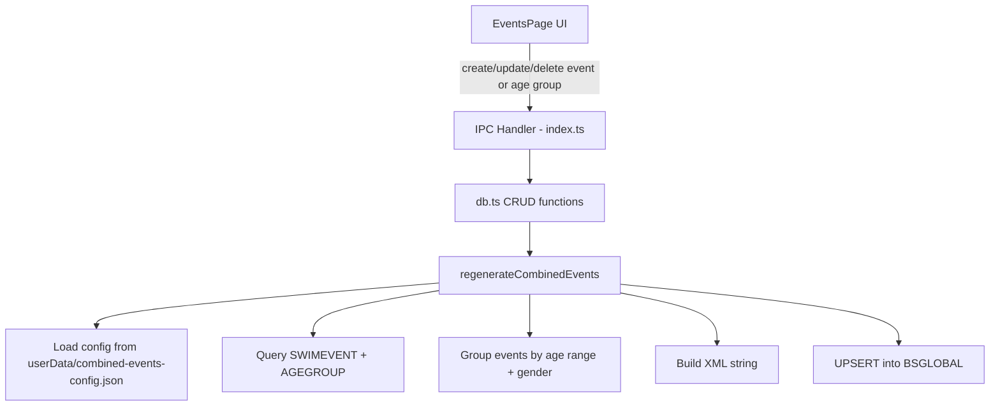
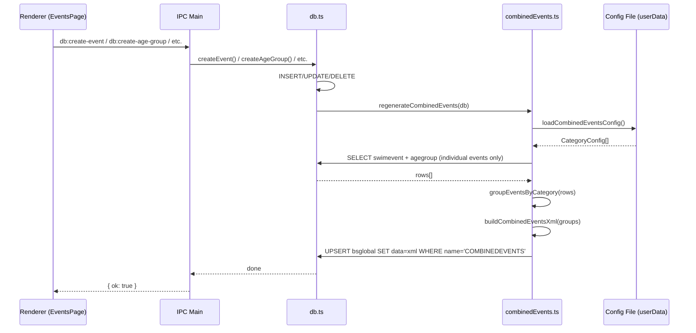

# Design Document: Combined Results Definition

## Overview

This feature auto-generates and updates the `COMBINEDEVENTS` XML definition stored in the `BSGLOBAL` table of the Meet Manager database. The XML defines "combined results" (cumulative point standings) for each age group/gender combination used in Canadian lifesaving competitions.

The function queries all individual (non-relay, non-admin) events and their age groups, groups them by age range and gender, then produces a `COMBINEDEVENTDEFINITION` XML document. Each `COMBINEDEVENT` element maps to one age/gender category and lists all events that belong to it. The function is triggered whenever events or age groups are created, modified, or deleted.

The design follows the existing architecture: a pure function in the main process (`src/main/`) that operates on the local SQLite database via `better-sqlite3`, exposed through the existing `db.ts` module pattern.

## Architecture



The `regenerateCombinedEvents` function is called as a side-effect after any event or age group mutation (create, update, delete). It reads the current state of events and age groups, computes the combined definitions, and writes the result to `BSGLOBAL`.

## Sequence Diagram



## Components and Interfaces

### Component 1: `combinedEvents.ts`

**Purpose**: Contains the pure logic for computing combined event definitions and serializing them to XML.

**Interface**:
```typescript
import Database from 'better-sqlite3'

/** A single age/gender category definition */
interface CombinedCategory {
  /** Display name, e.g. "Cumulatif 15-18 ans - dames" */
  name: string
  /** Age range key for grouping */
  ageMin: number
  ageMax: number  // -1 means unlimited
  /** Gender: 0=mixed, 1=male, 2=female */
  gender: number
  /** Points scale for this category */
  pointsForPlaces: string
  /** Whether this is the special "10 ans et moins - garçons" case */
  isSpecialNoEvents: boolean
}

/** An event row with its age group info, used for grouping */
interface EventWithAgeGroup {
  swimeventid: number
  eventnumber: number
  agemin: number
  agemax: number
  gender: number  // age group gender
  eventGender: number  // event-level gender
  relaycount: number
  internalevent: string | null
}

/** A fully resolved combined event definition ready for XML serialization */
interface CombinedEventDef {
  combinedeventid: number
  name: string
  titleforprints: string
  sumtype: string
  pointsforplaces: string
  maxresults: string
  sortbyresfirst: string
  penalty: string
  inpercent: string
  completedsq: string
  finalusetype: string
  agegroupeventid: number
  eventIds: number[]
}

/** Regenerate the COMBINEDEVENTS XML and write it to BSGLOBAL */
function regenerateCombinedEvents(db: Database.Database): void

/** Query individual events with their age groups (exported for testing) */
function queryEventsWithAgeGroups(db: Database.Database): EventWithAgeGroup[]

/** Group events into combined categories (exported for testing) */
function groupEventsByCategory(events: EventWithAgeGroup[]): Map<string, number[]>

/** Build the full XML string from combined definitions (exported for testing) */
function buildCombinedEventsXml(definitions: CombinedEventDef[]): string
```

**Responsibilities**:
- Query all individual (non-relay) events and their age groups
- Filter out admin/internal events
- Group events by age range + gender combination
- Apply the correct points scale per category
- Handle the special "10 ans et moins - garçons" case (no events, different flags)
- Serialize to UTF-16 XML matching Splash Meet Manager format
- Write/update the BSGLOBAL row

### Component 2: Integration in `db.ts`

**Purpose**: Call `regenerateCombinedEvents` after event/age group mutations.

**Interface**:
```typescript
// Existing functions modified to call regenerateCombinedEvents at the end:
export async function createEvent(...): Promise<number>
export async function deleteEvent(eventId: number): Promise<void>
export async function updateEvent(eventId: number, data: EventUpdate): Promise<void>
export async function createAgeGroup(...): Promise<number>
export async function deleteAgeGroup(agegroupId: number): Promise<void>
export async function updateAgeGroup(agegroupId: number, data: AgeGroupUpdate): Promise<void>
```

**Responsibilities**:
- Import and invoke `regenerateCombinedEvents` after each mutation
- Pass the local database instance

## Data Models

### Category Configuration (external JSON config file)

The category definitions (points scales, age groups, naming) are stored in a JSON config file
bundled with the app at `resources/combined-events-config.json`. At runtime, the app copies this
file to the user data directory (`app.getPath('userData')/combined-events-config.json`) on first
launch if it doesn't already exist. The function reads from the user data copy, allowing
temporary runtime modifications without rebuilding the app.

**File resolution order:**
1. `{userData}/combined-events-config.json` — user-editable runtime copy
2. `{app resources}/combined-events-config.json` — bundled default (fallback + reset source)

**Config file format** (`resources/combined-events-config.json`):
```json
{
  "categories": [
    {
      "ageMin": 1,
      "ageMax": 10,
      "gender": 0,
      "name": "Cumulatif 10 ans et moins - filles et garçons",
      "pointsForPlaces": "20,18,16,14,13,12,11,10,8,7,6,5,4,3,2,1",
      "sortbyresfirst": "F",
      "finalusetype": "2",
      "isSpecialNoEvents": false
    },
    {
      "ageMin": 1,
      "ageMax": 10,
      "gender": 1,
      "name": "Cumulatif 10 ans et moins - garçons",
      "pointsForPlaces": "20,18,16,14,13,12,11,10,8,7,6,5,4,3,2,1",
      "sortbyresfirst": "T",
      "finalusetype": "1",
      "isSpecialNoEvents": true
    },
    {
      "ageMin": 11,
      "ageMax": 12,
      "gender": 2,
      "name": "Cumulatif 11-12 ans - filles",
      "pointsForPlaces": "20,18,16,14,13,12,11,10,8,7,6,5,4,3,2,1",
      "sortbyresfirst": "F",
      "finalusetype": "2",
      "isSpecialNoEvents": false
    },
    {
      "ageMin": 11,
      "ageMax": 12,
      "gender": 1,
      "name": "Cumulatif 11-12 ans - garçons",
      "pointsForPlaces": "20,18,16,14,13,12,11,10,8,7,6,5,4,3,2,1",
      "sortbyresfirst": "F",
      "finalusetype": "2",
      "isSpecialNoEvents": false
    },
    {
      "ageMin": 13,
      "ageMax": 14,
      "gender": 2,
      "name": "Cumulatif 13-14 ans - filles",
      "pointsForPlaces": "20,18,16,14,13,12,11,10,8,7,6,5,4,3,2,1",
      "sortbyresfirst": "F",
      "finalusetype": "2",
      "isSpecialNoEvents": false
    },
    {
      "ageMin": 13,
      "ageMax": 14,
      "gender": 1,
      "name": "Cumulatif 13-14 ans - garçons",
      "pointsForPlaces": "10,8,6,4,3,2,1",
      "sortbyresfirst": "F",
      "finalusetype": "2",
      "isSpecialNoEvents": false
    },
    {
      "ageMin": 15,
      "ageMax": 18,
      "gender": 2,
      "name": "Cumulatif 15-18 ans - dames",
      "pointsForPlaces": "20,18,16,14,13,12,11,10,8,7,6,5,4,3,2,1",
      "sortbyresfirst": "F",
      "finalusetype": "2",
      "isSpecialNoEvents": false
    },
    {
      "ageMin": 15,
      "ageMax": 18,
      "gender": 1,
      "name": "Cumulatif 15-18 ans - hommes",
      "pointsForPlaces": "20,18,16,14,13,12,11,10,8,7,6,5,4,3,2,1",
      "sortbyresfirst": "F",
      "finalusetype": "2",
      "isSpecialNoEvents": false
    },
    {
      "ageMin": 19,
      "ageMax": -1,
      "gender": 2,
      "name": "Cumulatif 19 ans et plus - dames",
      "pointsForPlaces": "20,18,16,14,13,12,11,10,8,7,6,5,4,3,2,1",
      "sortbyresfirst": "F",
      "finalusetype": "2",
      "isSpecialNoEvents": false
    },
    {
      "ageMin": 19,
      "ageMax": -1,
      "gender": 1,
      "name": "Cumulatif 19 ans et plus - hommes",
      "pointsForPlaces": "20,18,16,14,13,12,11,10,8,7,6,5,4,3,2,1",
      "sortbyresfirst": "F",
      "finalusetype": "2",
      "isSpecialNoEvents": false
    }
  ]
}
```

**TypeScript interface:**
```typescript
interface CategoryConfig {
  ageMin: number
  ageMax: number       // -1 = no upper limit
  gender: number       // 0=mixed, 1=male, 2=female
  name: string         // French display name
  pointsForPlaces: string
  sortbyresfirst: string
  finalusetype: string
  isSpecialNoEvents: boolean
}

interface CombinedEventsConfig {
  categories: CategoryConfig[]
}

/**
 * Load the combined events config from the user data directory.
 * Falls back to the bundled default if the user copy doesn't exist.
 * On first call, copies the bundled default to user data if missing.
 */
function loadCombinedEventsConfig(): CombinedEventsConfig
```

### Age Group Matching Rules

```typescript
/**
 * An event's age group matches a category when:
 * - agegroup.agemin == category.ageMin
 * - agegroup.agemax == category.ageMax (with -1 meaning no limit)
 * - agegroup.gender == category.gender OR event.gender == category.gender
 *   (mixed events with gender=0 match the mixed category)
 */
type AgeGroupMatchFn = (ag: EventWithAgeGroup, cat: CategoryConfig) => boolean
```

## Algorithmic Pseudocode

### Main Regeneration Algorithm

```typescript
function regenerateCombinedEvents(db: Database.Database): void {
  // Step 1: Load category config from external JSON file
  const config = loadCombinedEventsConfig()

  // Step 2: Query all individual events with their age groups
  const eventsWithAgeGroups = queryEventsWithAgeGroups(db)

  // Step 3: For each category config, find matching events
  const definitions: CombinedEventDef[] = []

  for (const category of config.categories) {
    if (category.isSpecialNoEvents) {
      // Special case: "10 ans et moins - garçons" has no event list
      // Use combinedeventid = 0 or a placeholder
      definitions.push({
        combinedeventid: 0,
        name: category.name,
        titleforprints: category.name,
        sumtype: '2',
        pointsforplaces: category.pointsForPlaces,
        maxresults: '100',
        sortbyresfirst: category.sortbyresfirst,
        penalty: '10',
        inpercent: 'T',
        completedsq: 'F',
        finalusetype: category.finalusetype,
        agegroupeventid: 0,
        eventIds: [],
      })
      continue
    }

    // Find all events that have an age group matching this category
    const matchingEventIds = findMatchingEvents(eventsWithAgeGroups, category)

    if (matchingEventIds.length === 0) continue  // Skip categories with no events

    // Sort by event number for deterministic ordering
    matchingEventIds.sort((a, b) => a - b)

    const firstEventId = matchingEventIds[0]

    definitions.push({
      combinedeventid: firstEventId,
      name: category.name,
      titleforprints: category.name,
      sumtype: '2',
      pointsforplaces: category.pointsForPlaces,
      maxresults: '100',
      sortbyresfirst: category.sortbyresfirst,
      penalty: '10',
      inpercent: 'T',
      completedsq: 'F',
      finalusetype: category.finalusetype,
      agegroupeventid: firstEventId,
      eventIds: matchingEventIds,
    })
  }

  // Step 3: Build XML
  const xml = buildCombinedEventsXml(definitions)

  // Step 4: Upsert into BSGLOBAL
  db.prepare(
    `INSERT INTO bsglobal (name, data) VALUES ('COMBINEDEVENTS', ?)
     ON CONFLICT(name) DO UPDATE SET data = excluded.data`
  ).run(xml)
}
```

**Preconditions:**
- `db` is an open, valid `better-sqlite3` Database instance
- The `swimevent`, `agegroup`, `swimstyle`, and `bsglobal` tables exist

**Postconditions:**
- The `BSGLOBAL` row with `name='COMBINEDEVENTS'` contains valid XML
- The XML reflects the current state of all events and age groups
- Categories with no matching events are omitted (except the special no-events case)
- The `combinedeventid` and `agegroupeventid` reference the first event in each category's list

### Config Loading Algorithm

```typescript
import { app } from 'electron'
import { existsSync, copyFileSync, readFileSync } from 'node:fs'
import { join } from 'node:path'

const CONFIG_FILENAME = 'combined-events-config.json'

function loadCombinedEventsConfig(): CombinedEventsConfig {
  const userDataPath = app.getPath('userData')
  const userConfigPath = join(userDataPath, CONFIG_FILENAME)

  // Bundled default: in resources/ directory (packaged) or project root (dev)
  const bundledConfigPath = join(
    app.isPackaged
      ? join(process.resourcesPath, CONFIG_FILENAME)
      : join(__dirname, '../../resources', CONFIG_FILENAME)
  )

  // Copy bundled default to user data on first run (or if user deleted it)
  if (!existsSync(userConfigPath) && existsSync(bundledConfigPath)) {
    copyFileSync(bundledConfigPath, userConfigPath)
  }

  // Read from user data (allows runtime modifications)
  const configPath = existsSync(userConfigPath) ? userConfigPath : bundledConfigPath
  const raw = readFileSync(configPath, 'utf-8')
  return JSON.parse(raw) as CombinedEventsConfig
}
```

**Preconditions:**
- The bundled config file exists at `resources/combined-events-config.json`
- The user data directory is writable

**Postconditions:**
- Returns a valid `CombinedEventsConfig` object
- If the user data copy didn't exist, it now exists (copied from bundled default)
- Runtime modifications to the user data copy are reflected immediately on next call

### Event Query Algorithm

```typescript
function queryEventsWithAgeGroups(db: Database.Database): EventWithAgeGroup[] {
  return db.prepare(`
    SELECT e.swimeventid, e.eventnumber, e.gender AS eventgender, e.internalevent,
           ag.agemin, ag.agemax, ag.gender,
           ss.relaycount
    FROM swimevent e
    JOIN agegroup ag ON ag.swimeventid = e.swimeventid
    JOIN swimstyle ss ON e.swimstyleid = ss.swimstyleid
    WHERE ss.relaycount = 1
      AND (e.internalevent IS NULL OR e.internalevent = 'F')
    ORDER BY e.eventnumber, ag.sortcode
  `).all() as EventWithAgeGroup[]
}
```

**Preconditions:**
- Database contains valid `swimevent`, `agegroup`, and `swimstyle` rows

**Postconditions:**
- Returns only individual events (relaycount = 1)
- Excludes internal/admin events
- Each row represents one event–age group pair (an event with multiple age groups appears multiple times)

### Event Matching Algorithm

```typescript
function findMatchingEvents(
  events: EventWithAgeGroup[],
  category: CategoryConfig
): number[] {
  const matchedIds = new Set<number>()

  for (const event of events) {
    // Check age range match
    const ageMinMatch = event.agemin === category.ageMin
    const ageMaxMatch = category.ageMax === -1
      ? (event.agemax === -1 || event.agemax === 99)
      : event.agemax === category.ageMax

    if (!ageMinMatch || !ageMaxMatch) continue

    // Check gender match
    // Mixed category (gender=0): matches events with gender=0 (mixed)
    // Gendered category: matches age groups with same gender
    if (category.gender === 0) {
      if (event.eventGender === 0 || event.eventGender === 3) {
        matchedIds.add(event.swimeventid)
      }
    } else {
      if (event.gender === category.gender) {
        matchedIds.add(event.swimeventid)
      }
    }
  }

  return Array.from(matchedIds)
}
```

**Preconditions:**
- `events` contains valid event–age group pairs
- `category` has valid ageMin, ageMax, and gender values

**Postconditions:**
- Returns deduplicated event IDs (each event appears at most once)
- Only events whose age group exactly matches the category's range and gender are included

**Loop Invariants:**
- `matchedIds` contains only event IDs that satisfy both age range and gender criteria

### XML Serialization Algorithm

```typescript
function buildCombinedEventsXml(definitions: CombinedEventDef[]): string {
  const lines: string[] = []
  lines.push('<?xml version="1.0" encoding="UTF-16"?>')
  lines.push('<COMBINEDEVENTDEFINITION>')
  lines.push('  <COMBINEDEVENTS>')

  for (const def of definitions) {
    const attrs = [
      `combinedeventid="${def.combinedeventid}"`,
      `name="${escapeXml(def.name)}"`,
      `titleforprints="${escapeXml(def.titleforprints)}"`,
      `sumtype="${def.sumtype}"`,
      `pointsforplaces="${def.pointsforplaces}"`,
      `maxresults="${def.maxresults}"`,
      `sortbyresfirst="${def.sortbyresfirst}"`,
      `penalty="${def.penalty}"`,
      `inpercent="${def.inpercent}"`,
      `completedsq="${def.completedsq}"`,
      `finalusetype="${def.finalusetype}"`,
      `agegroupeventid="${def.agegroupeventid}"`,
    ].join(' ')

    if (def.eventIds.length === 0) {
      // Special case: self-closing tag with no EVENTS child
      lines.push(`    <COMBINEDEVENT ${attrs} />`)
    } else {
      lines.push(`    <COMBINEDEVENT ${attrs}>`)
      lines.push('      <EVENTS>')
      for (const eventId of def.eventIds) {
        lines.push(`        <EVENT eventid="${eventId}" mandatory="F" />`)
      }
      lines.push('      </EVENTS>')
      lines.push('    </COMBINEDEVENT>')
    }
  }

  lines.push('  </COMBINEDEVENTS>')
  lines.push('</COMBINEDEVENTDEFINITION>')
  return lines.join('\r\n')
}
```

**Preconditions:**
- `definitions` is a valid array of `CombinedEventDef` objects
- All `eventIds` reference existing `SWIMEVENT` rows

**Postconditions:**
- Returns well-formed XML matching the Splash Meet Manager format
- Uses `\r\n` line endings (Windows convention)
- Special characters in names are XML-escaped
- Categories with no events produce self-closing `<COMBINEDEVENT />` tags

## Key Functions with Formal Specifications

### `regenerateCombinedEvents(db)`

```typescript
function regenerateCombinedEvents(db: Database.Database): void
```

**Preconditions:**
- `db` is open and writable
- Schema tables (`swimevent`, `agegroup`, `swimstyle`, `bsglobal`) exist

**Postconditions:**
- `bsglobal` row with `name='COMBINEDEVENTS'` exists and contains valid XML
- XML reflects current database state (idempotent — calling twice produces same result)
- No other rows in any table are modified

**Loop Invariants:** N/A (no loops in top-level function)

### `findMatchingEvents(events, category)`

```typescript
function findMatchingEvents(events: EventWithAgeGroup[], category: CategoryConfig): number[]
```

**Preconditions:**
- `events` is non-null array
- `category` has valid `ageMin`, `ageMax`, `gender` fields

**Postconditions:**
- Result contains no duplicates
- Every ID in result corresponds to an event in `events` that matches the category
- Result is a subset of all unique `swimeventid` values in `events`

**Loop Invariants:**
- After processing event `i`: `matchedIds` contains exactly those event IDs from `events[0..i]` that satisfy the matching criteria

### `buildCombinedEventsXml(definitions)`

```typescript
function buildCombinedEventsXml(definitions: CombinedEventDef[]): string
```

**Preconditions:**
- `definitions` is non-null array
- Each definition has valid string fields (no unescaped XML special chars after escaping)

**Postconditions:**
- Output is well-formed XML (parseable by any XML parser)
- Output starts with `<?xml version="1.0" encoding="UTF-16"?>`
- Number of `<COMBINEDEVENT>` elements equals `definitions.length`
- For each definition with `eventIds.length > 0`: contains `<EVENTS>` child with matching `<EVENT>` elements

### `escapeXml(str)`

```typescript
function escapeXml(str: string): string {
  return str
    .replace(/&/g, '&amp;')
    .replace(/</g, '&lt;')
    .replace(/>/g, '&gt;')
    .replace(/"/g, '&quot;')
    .replace(/'/g, '&apos;')
}
```

**Preconditions:**
- `str` is a valid string

**Postconditions:**
- All XML special characters are properly escaped
- Result is safe for use in XML attribute values

## Example Usage

```typescript
import Database from 'better-sqlite3'
import { regenerateCombinedEvents } from './combinedEvents'

// After creating a new event with age groups:
const db = getLocalDb()

// Create event
const eventId = nextId('swimevent', 'swimeventid')
db.prepare(`INSERT INTO swimevent (...) VALUES (...)`).run(...)

// Create age group for the event
db.prepare(`INSERT INTO agegroup (...) VALUES (...)`).run(...)

// Regenerate combined events XML (idempotent)
regenerateCombinedEvents(db)

// Verify the result
const row = db.prepare(`SELECT data FROM bsglobal WHERE name = 'COMBINEDEVENTS'`).get()
console.log(row.data)
// Output: <?xml version="1.0" encoding="UTF-16"?>
//         <COMBINEDEVENTDEFINITION>
//           <COMBINEDEVENTS>
//             <COMBINEDEVENT combinedeventid="1139" name="Cumulatif 19 ans et plus - dames" ...>
//               <EVENTS>
//                 <EVENT eventid="1139" mandatory="F" />
//                 <EVENT eventid="1157" mandatory="F" />
//               </EVENTS>
//             </COMBINEDEVENT>
//             ...
//           </COMBINEDEVENTS>
//         </COMBINEDEVENTDEFINITION>
```

## Correctness Properties

### Property 1: Idempotency

Calling `regenerateCombinedEvents(db)` multiple times without changing events/age groups produces identical XML output each time.

```
∀ db_state: regenerate(db_state) == regenerate(db_state)
```

### Property 2: Completeness

Every individual (non-relay, non-admin) event that has an age group matching a known category appears in exactly one combined definition's event list.

```
∀ event ∈ individual_events:
  (∃ category ∈ CATEGORY_CONFIGS: matches(event, category))
  ⟹ event.id ∈ combined_definition(category).eventIds
```

### Property 3: No Duplicates

Each event ID appears at most once within a single combined definition's `<EVENTS>` list.

```
∀ definition ∈ output:
  |definition.eventIds| == |Set(definition.eventIds)|
```

### Property 4: Referential Integrity

Every `combinedeventid` and `agegroupeventid` in the XML references a valid `SWIMEVENTID` that exists in the database (except for the special no-events case which uses 0).

```
∀ def ∈ output where def.eventIds.length > 0:
  def.combinedeventid ∈ db.swimevent.swimeventid
  ∧ def.agegroupeventid ∈ db.swimevent.swimeventid
```

### Property 5: Category Coverage

For each `CategoryConfig` that has at least one matching event in the database, a corresponding `<COMBINEDEVENT>` element exists in the XML.

```
∀ cat ∈ CATEGORY_CONFIGS:
  (∃ event: matches(event, cat)) ⟹ (∃ def ∈ output: def.name == cat.name)
```

### Property 6: Well-Formed XML

The output is always parseable as valid XML.

```
∀ definitions: parseXml(buildCombinedEventsXml(definitions)) does not throw
```

### Property 7: Deterministic Ordering

Given the same database state, the function always produces the same XML (events sorted by ID within each category, categories in config order).

```
∀ db_state: regenerate(db_state) == regenerate(db_state)
∧ ∀ def ∈ output: def.eventIds == sort(def.eventIds)
```

## Error Handling

### Error Scenario 1: Empty Database (no events)

**Condition**: No `SWIMEVENT` rows exist, or all events are relays/admin.
**Response**: Produces a valid XML with only the special "10 ans et moins - garçons" entry (which has no events). Other categories are omitted.
**Recovery**: No recovery needed — this is a valid state.

### Error Scenario 2: Missing BSGLOBAL Row

**Condition**: The `COMBINEDEVENTS` row doesn't exist yet in `BSGLOBAL`.
**Response**: Uses `INSERT ... ON CONFLICT DO UPDATE` (upsert) to handle both insert and update cases.
**Recovery**: Automatic — the upsert handles both cases.

### Error Scenario 3: Event Without SwimStyle

**Condition**: A `SWIMEVENT` row has no matching `SWIMSTYLE` (broken FK).
**Response**: The JOIN in `queryEventsWithAgeGroups` naturally excludes such events.
**Recovery**: No crash — the event is simply not included in combined definitions.

### Error Scenario 4: Database Write Failure

**Condition**: SQLite write fails (disk full, locked, etc.).
**Response**: The `better-sqlite3` synchronous API throws an exception.
**Recovery**: The calling function (in `db.ts`) should let the error propagate to the IPC handler, which returns `{ ok: false, error: message }` to the renderer.

### Error Scenario 5: Config File Missing or Malformed

**Condition**: The `combined-events-config.json` file is missing from both user data and bundled resources, or contains invalid JSON.
**Response**: If missing entirely, throw an error with a clear message indicating the config file is required. If malformed JSON, let the `JSON.parse` error propagate with context about which file failed.
**Recovery**: The user can restore the file by deleting the user data copy (the bundled default will be re-copied on next call), or by reinstalling the app.

## Testing Strategy

### Unit Testing Approach

- Test `findMatchingEvents` with various event/age group combinations
- Test `buildCombinedEventsXml` produces valid XML for known inputs
- Test `escapeXml` handles all special characters
- Test edge cases: empty events list, single event, all categories populated

### Property-Based Testing Approach

**Property Test Library**: fast-check

- **Idempotency property**: For any valid database state, calling `regenerateCombinedEvents` twice produces the same `BSGLOBAL.data` value.
- **No duplicate events property**: For any generated XML, parsing it and extracting event IDs per combined definition yields no duplicates.
- **Well-formed XML property**: For any array of `CombinedEventDef` objects (with arbitrary valid strings), `buildCombinedEventsXml` produces parseable XML.
- **Completeness property**: For any set of events with age groups, every individual event appears in at least one combined definition (if its age range matches a known category).

### Integration Testing Approach

- Create a test SQLite database with known events and age groups
- Call `regenerateCombinedEvents` and verify the XML output matches expected structure
- Modify events (add/remove) and verify the XML updates correctly
- Compare output against a known-good XML snapshot from Splash Meet Manager

## Performance Considerations

- The function queries all events and age groups in a single query (JOIN), avoiding N+1 patterns
- For a typical Canadian lifesaving meet (30-50 events, 10 categories), this runs in < 5ms
- The function is synchronous (better-sqlite3), so it doesn't block the event loop for long
- Called only on event/age group mutations (not on every page load)

## Security Considerations

- No user input is directly interpolated into SQL (uses parameterized queries)
- XML output uses proper escaping via `escapeXml()` to prevent injection
- The function operates only on the local SQLite database (no network access)

## Dependencies

- `better-sqlite3`: Database access (already in project)
- `electron` (`app.getPath`, `app.isPackaged`, `process.resourcesPath`): For resolving config file paths (already in project)
- No new external dependencies required
- The XML is built with string concatenation (no XML library needed for this simple structure)
- **New file**: `resources/combined-events-config.json` — bundled config file with category definitions and points scales (must be included in electron-builder's `extraResources` or equivalent packaging config)
