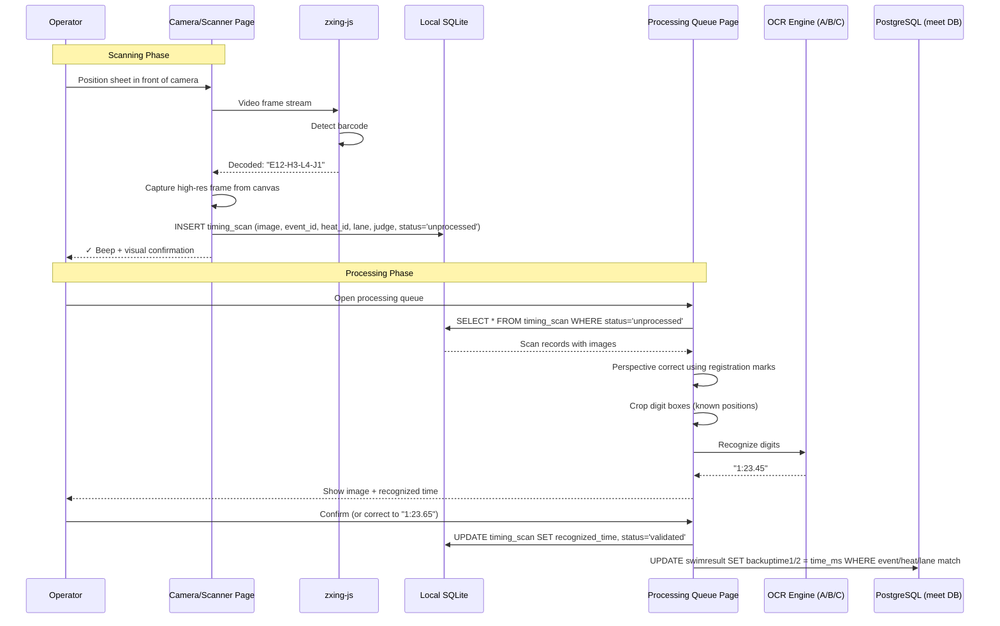

# Design Document: Timing Sheet OCR Scanning

## Overview

This feature replaces the manual entry of handwritten timing data from lane judges by introducing a camera-based scanning workflow. Printed timing sheets (3 lanes per sheet, cut apart) include a barcode identifying the event/heat/lane/judge. When sheets return from judges, the operator scans the barcode with the laptop camera, which triggers a photo capture stored in SQLite. A separate processing page presents unprocessed images for OCR-based time recognition, validation, and correction before saving to the results database.

The system is designed as a **prototyping harness** with 3 swappable OCR engines to evaluate which approach gives the best accuracy for handwritten swim times.

## Goals

1. Reduce time entry bottleneck at meets (currently the slowest manual step)
2. Preserve an image audit trail of every timing sheet
3. Support 2 judges per lane (times are averaged for the final result)
4. Allow rapid validation/correction of OCR results before committing
5. Compare 3 OCR approaches to find the best accuracy/complexity tradeoff

## Architecture

```mermaid
graph TD
    subgraph "Sheet Preparation"
        A[Generate PDF timing sheets] --> B[Print & cut sheets]
        B --> C[Judges write times in boxed digits]
    end

    subgraph "Scanning Station"
        D[Camera feed in Electron app] --> E[zxing-js barcode decode]
        E --> F[Canvas frame capture]
        F --> G[Store image + metadata in SQLite]
    end

    subgraph "Processing Queue"
        H[Load unprocessed scans] --> I[Perspective correction + digit crop]
        I --> J{OCR Engine}
        J -->|Prototype A| K[Tesseract.js]
        J -->|Prototype B| L[PaddleOCR subprocess]
        J -->|Prototype C| M[ONNX digit model]
        K --> N[Present recognized time]
        L --> N
        M --> N
        N --> O[Operator validates/corrects]
        O --> P[Save to swimresult backuptime fields]
    end
```



## Sequence Diagram



## Components and Interfaces

### Component 1: Barcode Scheme

**Purpose**: Encode event/heat/lane/judge identity into a scannable barcode printed on each timing sheet strip.

**Format**: Code128 barcode encoding a string: `E{eventNumber}-H{heatNumber}-L{lane}-J{judgeNumber}`

Examples:
- `E5-H2-L3-J1` → Event 5, Heat 2, Lane 3, Judge 1
- `E12-H1-L6-J2` → Event 12, Heat 1, Lane 6, Judge 2

**Why Code128**: High density, supports alphanumeric, excellent read rate even at small sizes, well-supported by zxing-js.

### Component 2: Sheet Generator (`src/main/timingSheets.ts`)

**Purpose**: Generate printable PDF timing sheets with 3 lane strips per page.

**Interface**:
```typescript
interface TimingSheetOptions {
  eventId: number
  eventNumber: number
  eventName: string
  heatNumber: number
  lanes: number[]          // e.g. [1, 2, 3] for first sheet, [4, 5, 6] for second
  judgeNumber: number      // 1 or 2
  athleteNames?: Map<number, string>  // lane → athlete name (optional, for reference)
}

interface SheetStrip {
  barcode: string          // e.g. "E5-H2-L3-J1"
  eventName: string
  heatNumber: number
  lane: number
  judgeNumber: number
  athleteName?: string
  digitBoxes: number       // 7 boxes for M:SS.HH format
}

/** Generate a PDF buffer containing timing sheets for a heat */
function generateTimingSheetPdf(options: TimingSheetOptions[]): Promise<Buffer>

/** Generate all timing sheets for a session */
function generateSessionTimingSheets(sessionId: number): Promise<Buffer>
```

**Sheet Layout** (per strip, landscape orientation):
```
┌─────────────────────────────────────────────────────────────┐
│ [BARCODE: E5-H2-L3-J1]                                     │
│                                                             │
│ Event 5: 50m Obstacle    Heat 2    Lane 3    Judge 1        │
│ Athlete: Jean Tremblay                                      │
│                                                             │
│ Time:  ┌─┐   ┌─┐ ┌─┐   ┌─┐ ┌─┐   ┌─┐ ┌─┐                │
│        │ │ : │ │ │ │ . │ │ │ │ . │ │ │ │                   │
│        └─┘   └─┘ └─┘   └─┘ └─┘   └─┘ └─┘                │
│         M     S   S      H   H      C   C                  │
│                                                             │
│ ■                                               ■           │
└─────────────────────────────────────────────────────────────┘
  ↑ registration marks (corners)                  ↑
```

- **Digit boxes**: 7 cells for `M:SS.HH.CC` (minutes, seconds, hundredths, centièmes if needed — configurable)
- **Registration marks**: 4 corner squares for perspective correction during image processing
- **Separators** (`:` and `.`): Pre-printed between boxes so judges only write digits

### Component 3: Camera Scanner Page (`src/renderer/src/pages/TimingScanPage.tsx`)

**Purpose**: Live camera feed with barcode detection and automatic photo capture.

**Interface**:
```typescript
interface ScanResult {
  barcode: string
  eventNumber: number
  heatNumber: number
  lane: number
  judgeNumber: number
  imageDataUrl: string     // JPEG base64
  timestamp: Date
}

// Page state
interface ScanPageState {
  cameraActive: boolean
  lastScan: ScanResult | null
  scanCount: number        // total scans this session
  recentScans: ScanResult[] // last 5 for visual feedback
}
```

**Behavior**:
1. On page mount, request camera access (`getUserMedia`)
2. Render video feed in a `<video>` element
3. Run zxing-js barcode detection on each frame (~10fps)
4. On successful decode:
   - Play audio beep
   - Capture high-resolution frame from canvas
   - Parse barcode string to extract event/heat/lane/judge
   - Send image + metadata to main process via IPC
   - Show green flash + decoded info overlay
   - Debounce: ignore same barcode for 3 seconds (prevent double-scan)

### Component 4: Scan Storage (`src/main/timingScanDb.ts`)

**Purpose**: SQLite table for storing scanned images and their processing status.

**Schema**:
```sql
CREATE TABLE IF NOT EXISTS timing_scan (
  scan_id         INTEGER PRIMARY KEY AUTOINCREMENT,
  event_number    INTEGER NOT NULL,
  heat_number     INTEGER NOT NULL,
  lane            INTEGER NOT NULL,
  judge_number    INTEGER NOT NULL,    -- 1 or 2
  barcode_raw     TEXT NOT NULL,        -- original barcode string
  image_blob      BLOB NOT NULL,        -- JPEG image data
  scanned_at      TEXT NOT NULL,        -- ISO 8601 timestamp
  status          TEXT NOT NULL DEFAULT 'unprocessed',  -- unprocessed | recognized | validated | error
  recognized_time TEXT,                 -- OCR result, e.g. "1:23.45"
  validated_time  TEXT,                 -- operator-confirmed time
  time_ms         INTEGER,             -- final time in milliseconds
  ocr_engine      TEXT,                -- which engine was used (tesseract|paddle|onnx)
  ocr_confidence  REAL,                -- confidence score 0-1
  processed_at    TEXT,                 -- when OCR was run
  validated_at    TEXT,                 -- when operator confirmed
  notes           TEXT                  -- operator notes (e.g. "illegible, asked judge")
);

CREATE INDEX IF NOT EXISTS ix_timing_scan_status ON timing_scan (status);
CREATE INDEX IF NOT EXISTS ix_timing_scan_event_heat ON timing_scan (event_number, heat_number, lane);
```

**Interface**:
```typescript
interface TimingScan {
  scanId: number
  eventNumber: number
  heatNumber: number
  lane: number
  judgeNumber: number
  barcodeRaw: string
  imageBlob: Buffer
  scannedAt: string
  status: 'unprocessed' | 'recognized' | 'validated' | 'error'
  recognizedTime: string | null
  validatedTime: string | null
  timeMs: number | null
  ocrEngine: string | null
  ocrConfidence: number | null
  processedAt: string | null
  validatedAt: string | null
  notes: string | null
}

/** Store a new scan */
function insertScan(scan: Omit<TimingScan, 'scanId'>): number

/** Get all unprocessed scans */
function getUnprocessedScans(): TimingScan[]

/** Get scans for a specific event/heat */
function getScansForHeat(eventNumber: number, heatNumber: number): TimingScan[]

/** Update scan with OCR result */
function updateScanOcrResult(scanId: number, result: {
  recognizedTime: string
  ocrEngine: string
  ocrConfidence: number
}): void

/** Update scan with validated time */
function validateScan(scanId: number, validatedTime: string, timeMs: number): void

/** Mark scan as error */
function markScanError(scanId: number, notes: string): void
```

### Component 5: Image Processing Pipeline (`src/main/timingImageProcess.ts`)

**Purpose**: Perspective-correct scanned images and crop individual digit boxes.

**Interface**:
```typescript
interface RegistrationMarks {
  topLeft: { x: number; y: number }
  topRight: { x: number; y: number }
  bottomLeft: { x: number; y: number }
  bottomRight: { x: number; y: number }
}

interface CroppedDigit {
  index: number            // 0-6 for M:SS.HH format
  imageData: Buffer        // grayscale PNG, 28x28 pixels (MNIST-compatible)
  bounds: { x: number; y: number; width: number; height: number }
}

/** Detect registration marks in a scanned image */
function detectRegistrationMarks(imageBuffer: Buffer): RegistrationMarks | null

/** Apply perspective correction to straighten the sheet */
function perspectiveCorrect(imageBuffer: Buffer, marks: RegistrationMarks): Buffer

/** Crop individual digit boxes from a corrected image */
function cropDigitBoxes(correctedImage: Buffer, digitCount: number): CroppedDigit[]

/** Full pipeline: detect → correct → crop */
function processTimingImage(imageBuffer: Buffer): {
  corrected: Buffer
  digits: CroppedDigit[]
} | null
```

**Implementation notes**:
- Use `sharp` (already common in Node.js image processing) for resize/crop/grayscale
- Registration mark detection: threshold to B&W, find 4 darkest square regions in expected corner positions
- Digit box positions are relative to the corrected image dimensions (known from sheet layout)

### Component 6: OCR Engine Interface (`src/main/ocrEngine.ts`)

**Purpose**: Abstract interface for swappable OCR engines.

**Interface**:
```typescript
interface OcrResult {
  text: string             // recognized digit(s)
  confidence: number       // 0-1
}

interface TimeOcrResult {
  timeString: string       // e.g. "1:23.45"
  digitResults: OcrResult[] // per-digit results
  overallConfidence: number
}

interface OcrEngine {
  name: string             // 'tesseract' | 'paddle' | 'onnx'
  
  /** Initialize the engine (load models, etc.) */
  initialize(): Promise<void>
  
  /** Recognize a single digit from a cropped image */
  recognizeDigit(imageBuffer: Buffer): Promise<OcrResult>
  
  /** Recognize a full time from an array of cropped digits */
  recognizeTime(digits: CroppedDigit[]): Promise<TimeOcrResult>
  
  /** Clean up resources */
  dispose(): Promise<void>
}
```

### Component 7: Prototype A — Tesseract.js Engine (`src/main/ocrTesseract.ts`)

**Purpose**: OCR using Tesseract.js WASM engine.

**Setup**:
- `npm install tesseract.js`
- Configure PSM 10 (single character mode)
- Whitelist: `0123456789`

**Interface**: Implements `OcrEngine`

```typescript
class TesseractOcrEngine implements OcrEngine {
  name = 'tesseract'
  private worker: Tesseract.Worker | null = null

  async initialize(): Promise<void> {
    // Create worker with eng trained data
    // Set PSM 10, whitelist digits only
  }

  async recognizeDigit(imageBuffer: Buffer): Promise<OcrResult> {
    // Run single-char recognition
    // Return digit + confidence
  }

  async recognizeTime(digits: CroppedDigit[]): Promise<TimeOcrResult> {
    // Recognize each digit, assemble time string
  }

  async dispose(): Promise<void> {
    // Terminate worker
  }
}
```

### Component 8: Prototype B — PaddleOCR Engine (`src/main/ocrPaddle.ts`)

**Purpose**: OCR using PaddleOCR via Python subprocess.

**Setup**:
- Bundle a Python script `scripts/paddle_ocr_server.py`
- Communicates via stdin/stdout JSON lines
- Requires: `paddlepaddle`, `paddleocr` (CPU-only)

**Interface**: Implements `OcrEngine`

```typescript
class PaddleOcrEngine implements OcrEngine {
  name = 'paddle'
  private process: ChildProcess | null = null

  async initialize(): Promise<void> {
    // Spawn Python process
    // Wait for "ready" message
  }

  async recognizeDigit(imageBuffer: Buffer): Promise<OcrResult> {
    // Send base64 image via stdin
    // Read JSON result from stdout
  }

  async recognizeTime(digits: CroppedDigit[]): Promise<TimeOcrResult> {
    // Can also send full strip for line-level OCR
  }

  async dispose(): Promise<void> {
    // Kill Python process
  }
}
```

### Component 9: Prototype C — ONNX Digit Model Engine (`src/main/ocrOnnx.ts`)

**Purpose**: OCR using a small CNN model (MNIST-style) via onnxruntime-node.

**Setup**:
- `npm install onnxruntime-node`
- Bundle pre-trained MNIST ONNX model (~50KB)
- Input: 28×28 grayscale image → Output: digit 0-9 + confidence

**Interface**: Implements `OcrEngine`

```typescript
class OnnxOcrEngine implements OcrEngine {
  name = 'onnx'
  private session: InferenceSession | null = null

  async initialize(): Promise<void> {
    // Load ONNX model file
    // Create inference session
  }

  async recognizeDigit(imageBuffer: Buffer): Promise<OcrResult> {
    // Resize to 28x28, normalize
    // Run inference
    // Softmax → digit with highest probability
  }

  async recognizeTime(digits: CroppedDigit[]): Promise<TimeOcrResult> {
    // Recognize each digit independently
    // Assemble time string with separators
  }

  async dispose(): Promise<void> {
    // Close session
  }
}
```

### Component 10: Processing Queue Page (`src/renderer/src/pages/TimingProcessPage.tsx`)

**Purpose**: UI for reviewing OCR results and validating/correcting times.

**Interface**:
```typescript
interface ProcessPageState {
  scans: TimingScan[]
  currentIndex: number
  ocrEngine: 'tesseract' | 'paddle' | 'onnx'
  filter: 'unprocessed' | 'recognized' | 'all'
}

// Per-scan view shows:
// - Original scanned image (zoomable)
// - Cropped digit images with individual OCR results
// - Assembled time string (editable)
// - Confidence indicator (green/yellow/red)
// - Accept / Correct / Skip / Flag buttons
```

**Behavior**:
1. Load all scans matching the current filter
2. For unprocessed scans: run OCR automatically, show results
3. Operator reviews each scan:
   - **Accept**: Save recognized time as validated, write to meet DB
   - **Correct**: Edit the time, save corrected version
   - **Skip**: Move to next (come back later)
   - **Flag**: Mark as error with notes (illegible, wrong sheet, etc.)
4. Keyboard shortcuts for speed: Enter=Accept, Tab=Next, Esc=Skip

### Component 11: IPC Handlers (`src/main/index.ts` additions)

**New IPC channels**:
```typescript
// Timing sheet generation
'timing:generate-sheets'       // (sessionId) → PDF buffer
'timing:generate-heat-sheets'  // (eventId, heatNumber) → PDF buffer

// Scanning
'timing:save-scan'             // (scanData) → scanId
'timing:get-unprocessed'       // () → TimingScan[]
'timing:get-scans-for-heat'    // (eventNumber, heatNumber) → TimingScan[]

// OCR processing
'timing:run-ocr'               // (scanId, engine) → TimeOcrResult
'timing:validate-scan'         // (scanId, time, timeMs) → void
'timing:mark-error'            // (scanId, notes) → void

// Results integration
'timing:commit-to-results'     // (eventNumber, heatNumber) → void
  // Finds swimresult rows, writes backuptime1/backuptime2 from validated scans
```

## Data Flow: Time Conversion

```typescript
/** Parse a time string "M:SS.HH" to milliseconds */
function parseTimeToMs(timeStr: string): number {
  // "1:23.45" → 83450 ms
  // "0:45.12" → 45120 ms
  // "2:01.00" → 121000 ms
  const match = timeStr.match(/^(\d):(\d{2})\.(\d{2})$/)
  if (!match) throw new Error(`Invalid time format: ${timeStr}`)
  const [, min, sec, hundredths] = match
  return (parseInt(min) * 60 + parseInt(sec)) * 1000 + parseInt(hundredths) * 10
}

/** Format milliseconds to "M:SS.HH" */
function formatMsToTime(ms: number): string {
  const totalHundredths = Math.round(ms / 10)
  const hundredths = totalHundredths % 100
  const totalSeconds = Math.floor(totalHundredths / 100)
  const seconds = totalSeconds % 60
  const minutes = Math.floor(totalSeconds / 60)
  return `${minutes}:${String(seconds).padStart(2, '0')}.${String(hundredths).padStart(2, '0')}`
}
```

## Data Flow: Results Integration

When the operator commits validated scans for a heat:

1. Query `timing_scan` for all validated scans matching the event/heat
2. Group by lane
3. For each lane:
   - Judge 1 time → `swimresult.backuptime1`
   - Judge 2 time → `swimresult.backuptime2`
   - Average of both → `swimresult.swimtime` (if both present)
4. Find the matching `swimresult` row via event number + heat + lane
5. Update the PostgreSQL meet database

```typescript
function commitHeatResults(eventNumber: number, heatNumber: number): void {
  const scans = getValidatedScansForHeat(eventNumber, heatNumber)
  
  for (const [lane, laneScans] of groupByLane(scans)) {
    const judge1 = laneScans.find(s => s.judgeNumber === 1)
    const judge2 = laneScans.find(s => s.judgeNumber === 2)
    
    const time1 = judge1?.timeMs ?? null
    const time2 = judge2?.timeMs ?? null
    
    // Average if both present
    const avgTime = (time1 && time2) ? Math.round((time1 + time2) / 2) : (time1 ?? time2)
    
    // Update swimresult in meet DB
    updateSwimResult(eventNumber, heatNumber, lane, {
      backuptime1: time1,
      backuptime2: time2,
      swimtime: avgTime,
    })
  }
}
```

## Prototyping Strategy

The 3 OCR engines share the same:
- Sheet layout and barcode scheme
- Camera capture and storage pipeline
- Image processing (perspective correction, digit cropping)
- Validation UI
- Results integration

Only the `OcrEngine` implementation differs. The processing page has a dropdown to select which engine to use, allowing side-by-side comparison on the same scanned images.

### Testing Protocol

1. Print 50 test sheets with the boxed digit layout
2. Have 5-6 people fill them with realistic times (varying handwriting)
3. Scan all sheets through the capture pipeline
4. Run each OCR engine on the same cropped digit images
5. Measure: per-digit accuracy, per-time accuracy, processing speed, failure modes

### Success Criteria

| Metric | Target |
|--------|--------|
| Per-digit accuracy | >90% |
| Per-full-time accuracy | >75% (all 5-7 digits correct) |
| Scan-to-validate time | <5 seconds per sheet |
| False confidence (high confidence + wrong) | <5% |

## Error Handling

### Barcode not detected
- Show "No barcode found" message
- Allow manual entry of event/heat/lane/judge
- Still capture and store the image

### Registration marks not found
- Fall back to manual crop region selection
- Or use the full image without perspective correction

### OCR confidence below threshold
- Highlight low-confidence digits in red
- Pre-select the input field for correction
- Never auto-commit low-confidence results

### Duplicate scan (same barcode scanned twice)
- Warn operator: "This sheet was already scanned at {time}"
- Allow rescan (replaces previous image) or skip

### Camera access denied
- Show clear error message with instructions to grant permission
- Provide fallback: file upload for pre-captured images

## Performance Considerations

- Camera barcode detection runs at ~10fps (sufficient for handheld scanning)
- Image storage as JPEG (~50-100KB per scan) keeps SQLite manageable
- OCR processing is async — doesn't block the scanning workflow
- Batch processing: can run OCR on all unprocessed scans in background
- ONNX inference: ~1ms per digit (fastest)
- Tesseract.js: ~100-200ms per digit (acceptable)
- PaddleOCR: ~50ms per digit (subprocess overhead)

## Security Considerations

- Camera access requires explicit user permission (Electron `getUserMedia`)
- Scanned images stored locally only (no network transmission)
- SQLite database is local to the machine
- No external API calls for OCR (all processing is local)

## Dependencies

### Shared (all prototypes)
- `@aspect-build/zxing-js` or `@aspect-build/zxing-wasm`: Barcode scanning (new)
- `sharp`: Image processing — resize, crop, grayscale, perspective (new)
- `pdfkit` or `jspdf`: PDF generation for timing sheets (new)
- `better-sqlite3`: Scan storage (existing)

### Prototype A
- `tesseract.js`: WASM-based OCR engine (new)

### Prototype B
- Python 3.x with `paddlepaddle` + `paddleocr` (external, not bundled in npm)

### Prototype C
- `onnxruntime-node`: ONNX model inference (new)
- Pre-trained MNIST ONNX model file (~50KB, bundled)

## Future Enhancements (out of scope for prototype)

- Fine-tune ONNX model on actual judge handwriting samples
- Auto-commit high-confidence results without operator review
- Mobile companion app for scanning (phone camera → WebSocket → desktop)
- Integration with Quantum timing system for cross-validation
- Multi-sheet batch scanning (feed sheets through document scanner)
