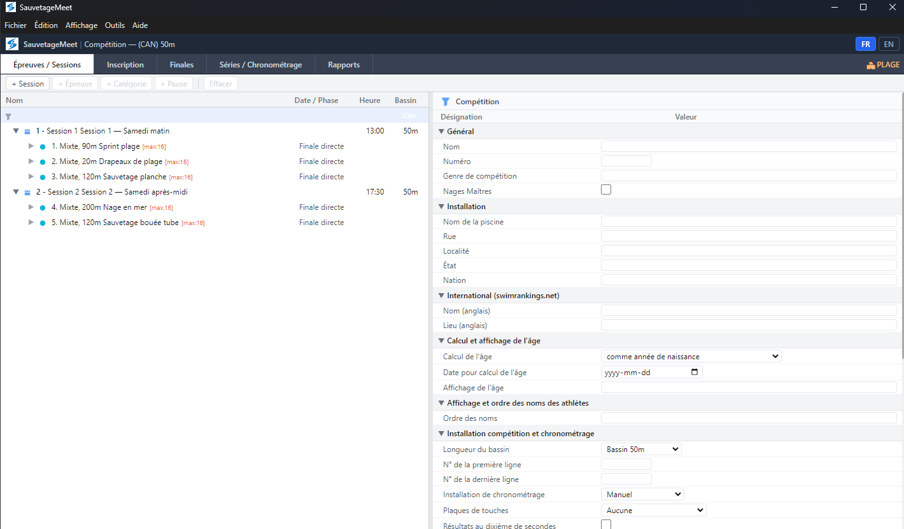
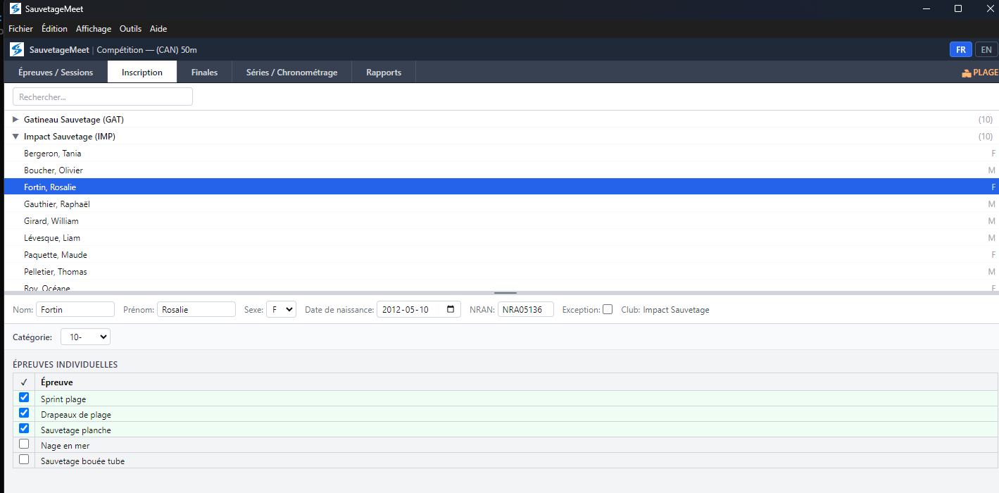
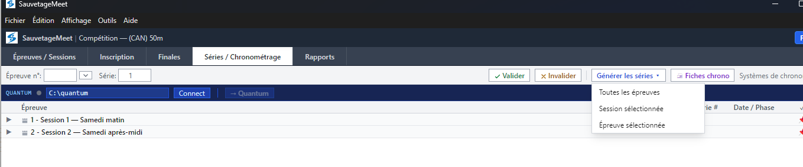
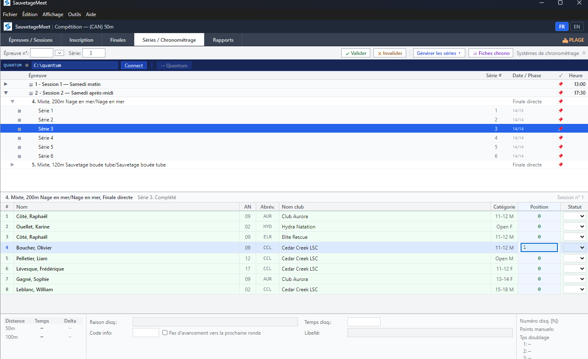

# SauvetageMeet — Flux de travail plage

## Vue d'ensemble

SauvetageMeet gère les épreuves de sauvetage sportif en **plage (classées)** où les athlètes sont classés par position (1er, 2e, 3e…) plutôt que chronométrés. Ce guide couvre les différences avec le mode piscine et le flux complet d'une compétition plage.

---

## Différences clés avec le mode piscine

| Aspect | Piscine | Plage |
|--------|---------|-------|
| Résultats | Temps en M:SS.CC | Position (1er, 2e, 3e…) |
| Couloirs | Assignation centre-extérieur | Pas de couloirs (numérotation séquentielle) |
| Capacité par série | Nombre de couloirs de la session | Max inscriptions de l'épreuve (ou défaut du gabarit) |
| Placement | Par temps d'inscription | Aléatoire |
| Qualification finales | Meilleur temps préliminaire | Meilleure position préliminaire (la plus basse) |
| Onglets Scanner/OCR | Visibles | **Masqués** |
| Meilleurs temps | Affichés | Non applicable |

---

## Démarrage

### Créer un meet plage

1. Menu Fichier → **Nouveau meet plage**
2. Confirmer le dialogue de création — ceci charge le gabarit plage avec les épreuves spécifiques (IDs 601-605)
3. La barre de titre affiche un badge **🏖 PLAGE** pour indiquer le mode plage

> **Attention** : Créer un nouveau meet supprime toutes les données existantes. Cette action est irréversible.

---

### Importer les inscriptions

1. Menu Fichier → **Importer un fichier LENEX…**
2. Sélectionner le fichier `.lxf` des inscriptions
3. Les athlètes et clubs sont importés
4. Aucun temps d'inscription n'est importé (les épreuves plage n'utilisent pas de temps)

---

## Onglet Épreuves — Structure des épreuves plage

L'onglet épreuves fonctionne comme en mode piscine, mais les épreuves plage ont des caractéristiques différentes :

- Les épreuves utilisent des styles de nage spécifiques plage (IDs 601-605)
- Pas de distance en mètres — les épreuves sont basées sur l'activité (ex. : « Sprint plage », « Sauvetage planche »)
- Le nombre maximum d'inscriptions par série est défini par épreuve (`swimevent.maxentries`)

---

## Onglets Inscriptions

L'inscription aux épreuves plage est simplifiée :

- **Inscriptions individuelles** — **case à cocher uniquement** — pas de temps d'inscription nécessaire
- Pas de meilleurs temps affichés (non applicable pour les épreuves classées)
- **Inscriptions relais** — l'assignation des relais fonctionne comme en mode piscine

---

## Onglet Séries — Placement aléatoire

### Générer les séries

1. Naviguer vers l'onglet **Séries**
2. Cliquer **Générer séries**
3. Les séries plage utilisent le **placement aléatoire** :
   - Les athlètes sont mélangés aléatoirement
   - Distribués uniformément entre les séries
   - Maximum de participants par série selon la config de l'épreuve (défaut : 16)
   - Pas d'assignation de couloirs (numérotation séquentielle comme placeholders)

---

### Visualiser les séries

La vue des séries pour les épreuves plage affiche :
- Liste des participants (numérotés séquentiellement, pas par couloir)
- Noms des athlètes et clubs
- Pas de colonne de temps d'inscription

---

### Saisir les positions

La saisie des positions a une interface spécialisée :

1. Sélectionner une épreuve et une série
2. Cliquer sur la cellule de position d'un athlète
3. La cellule **se pré-remplit avec la prochaine position disponible** (texte sélectionné pour modification)
4. Taper le numéro de position (1, 2, 3…) ou accepter la valeur pré-remplie
5. Appuyer sur **Entrée** pour confirmer

#### Comportements spéciaux

- **Position en double** → les positions des deux athlètes sont **échangées** automatiquement
- **Prévention des trous** → impossible d'entrer une position supérieure au nombre total d'athlètes ayant déjà une position
- **Colonne de rang** masquée (la position EST le résultat)

---

## Finales — Qualification par position

### Fonctionnement de la qualification

Pour les épreuves plage avec préliminaires + finales :

1. Après la saisie des positions préliminaires, naviguer vers l'onglet **Finales**
2. La qualification est basée sur la **meilleure position** (nombre le plus bas = meilleur)
3. Les athlètes avec la position 1 en préliminaires sont classés premiers

---

### Générer les séries de finales

1. Cliquer **Générer finales**
2. Les séries de finales sont générées avec les athlètes qualifiés
3. Saisir les positions de finales de la même façon que les préliminaires

---

## Ce qui est masqué en mode plage

Les fonctionnalités suivantes ne sont **pas disponibles** en mode plage :

- ❌ **Onglet Scanner** — pas de fiches chrono à numériser
- ❌ **Onglet Traitement** — pas d'OCR nécessaire
- ❌ **Impression des fiches chrono** — pas de chronomètres
- ❌ **Affichage des meilleurs temps** — les positions ne sont pas comparables entre compétitions
- ❌ **Champs de temps d'inscription** — pas de temps à saisir
- ❌ **Intégration Quantum** — pas de chronométrage électronique

---

## Onglet Rapport

L'onglet rapport fonctionne de la même façon mais affiche :
- Résultats par position (1er, 2e, 3e…) au lieu des temps
- Classement des épreuves combinées (points basés sur la position)
- Classement par club

---

## Sauvegarde

Identique au mode piscine :
- Menu Fichier → **Sauvegarder le meet (.smb)…** pour une sauvegarde complète
- Menu Fichier → **Synchronisation ↑** pour la synchro vers la base distante

---

## Référence rapide

| Action | Comment |
|--------|---------|
| Créer un nouveau meet plage | Fichier → Nouveau meet plage |
| Importer les inscriptions | Fichier → Importer un fichier LENEX |
| Générer les séries (aléatoire) | Onglet Séries → Générer séries |
| Saisir les positions | Onglet Séries → Cliquer cellule position → Taper le numéro |
| Échanger des positions | Entrer un numéro de position en double |
| Générer les finales | Onglet Finales → Générer finales |
| Sauvegarder le meet | Fichier → Sauvegarder le meet (.smb) |
| Identifier le mode plage | Chercher le badge 🏖 PLAGE dans la barre d'onglets |
