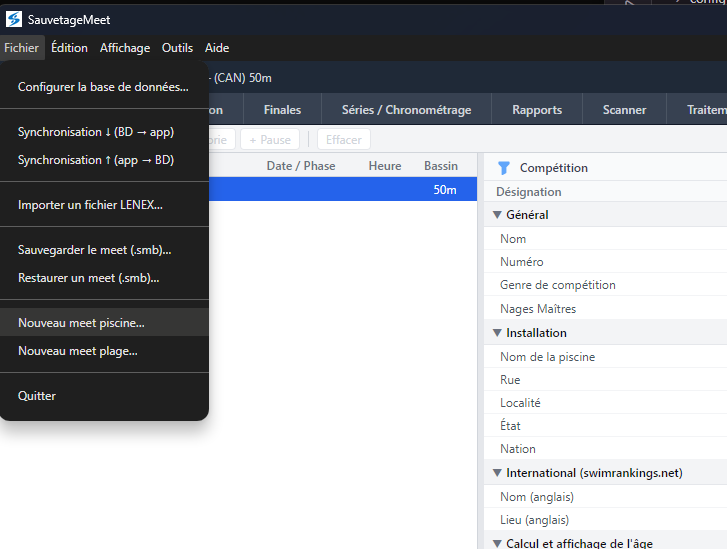
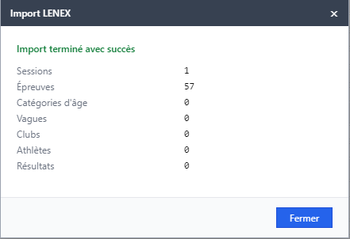
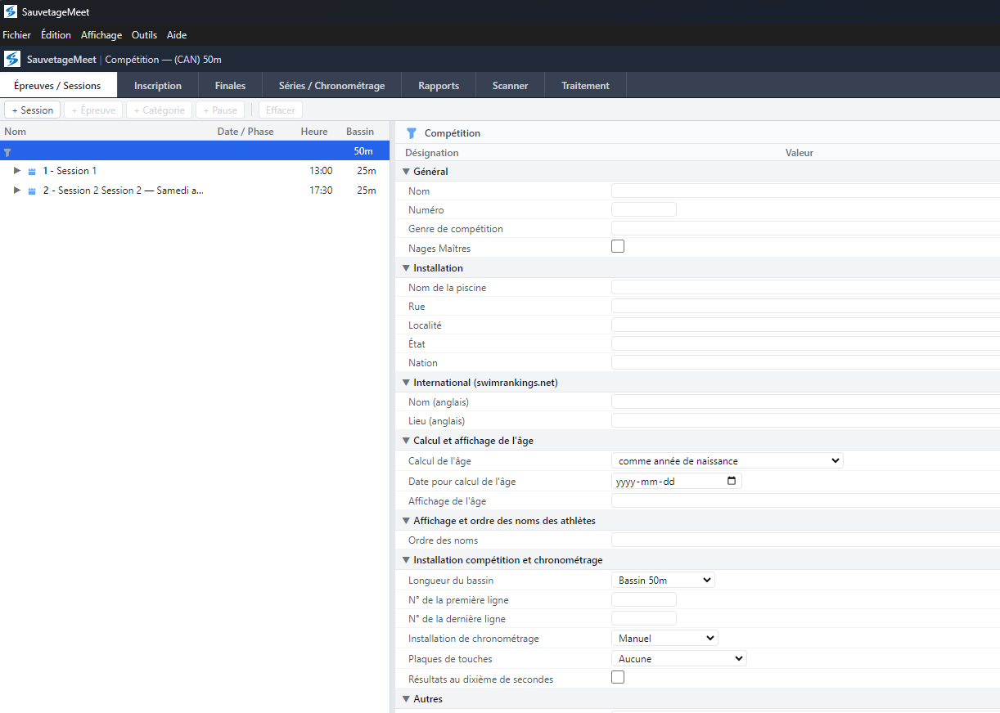
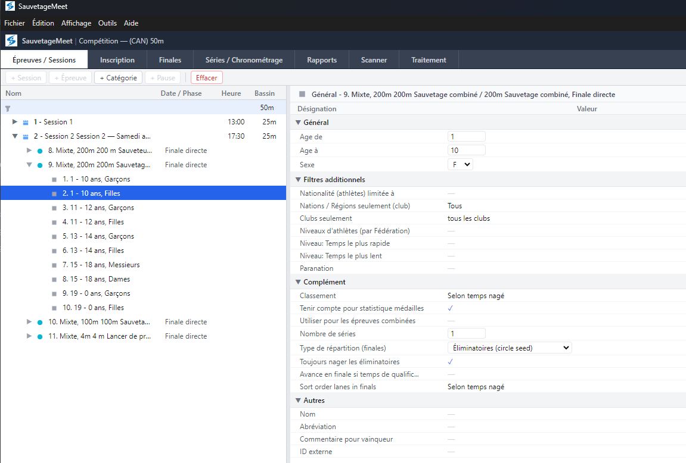
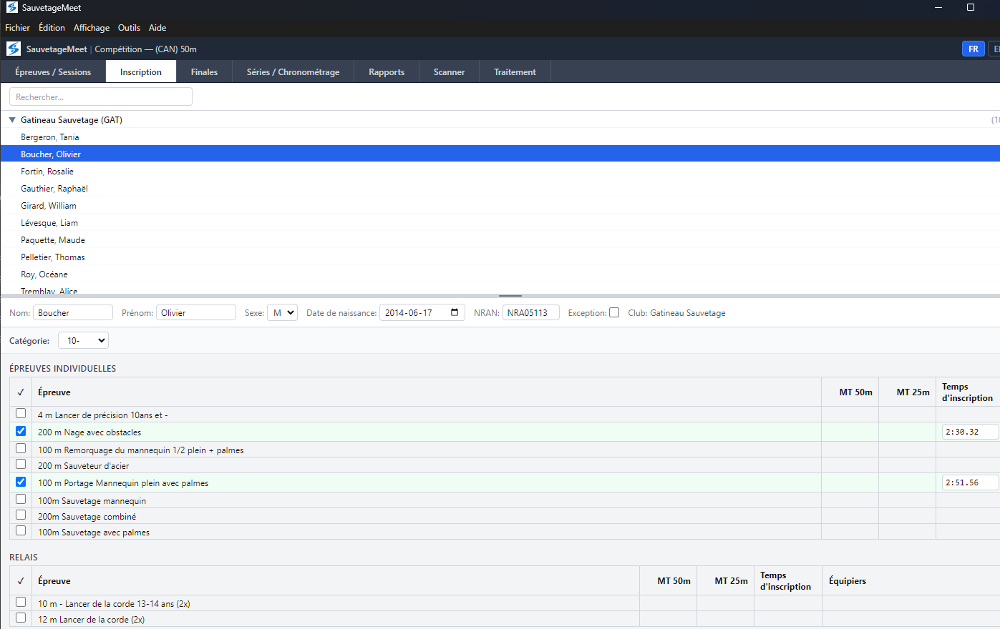
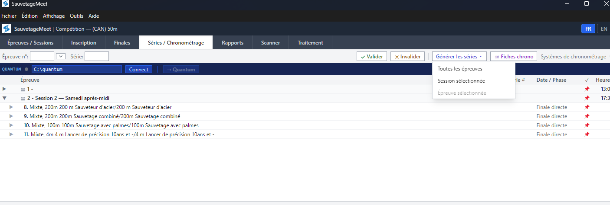
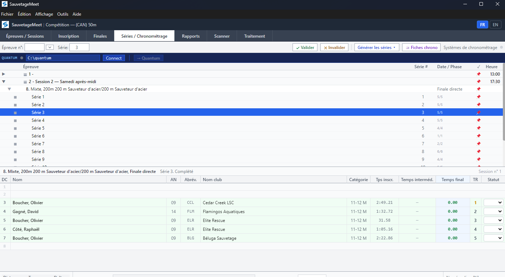
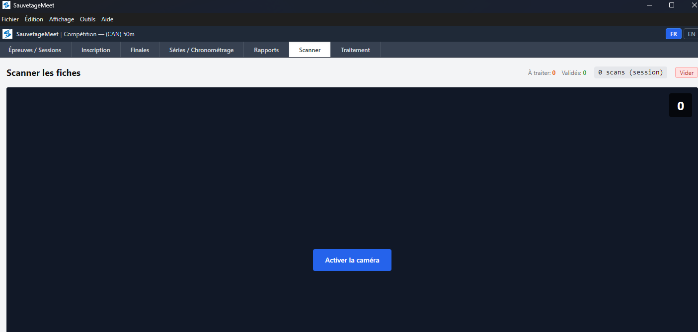
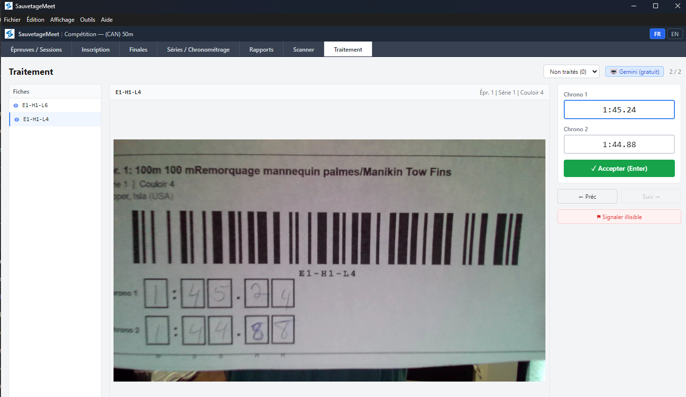
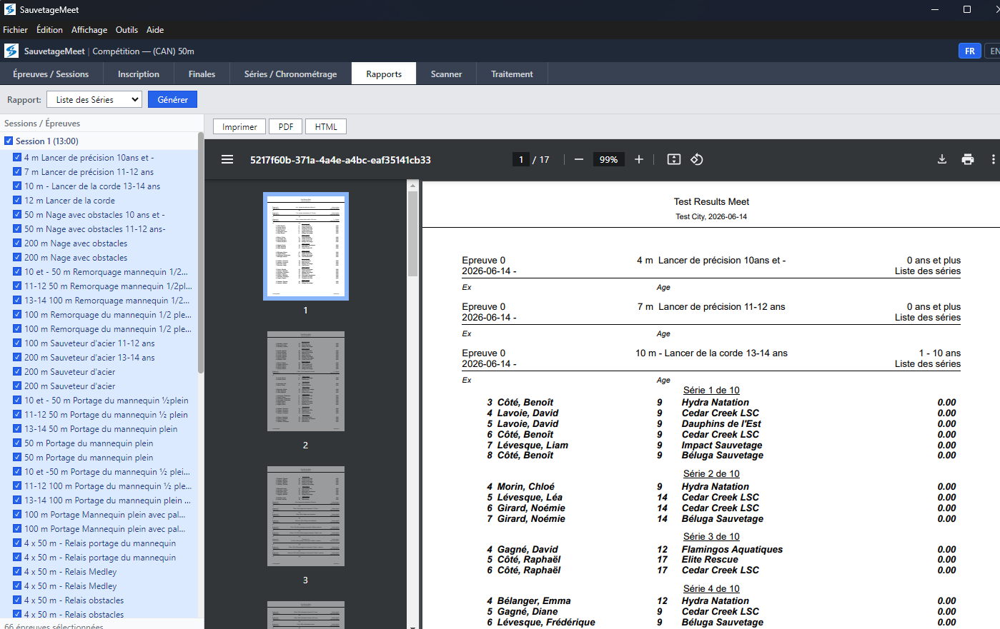

# SauvetageMeet — Pool Competition Workflow

## Overview

SauvetageMeet is the desktop application used on competition day to manage heats, timing, results, and scoring for **pool (timed)** lifesaving events. This guide covers the complete workflow from meet setup to final results.

---

## Getting Started

### Create or Restore a Meet

On first launch, you have three options:

1. **New Pool Meet** — File menu → *Nouveau meet piscine* — creates a fresh meet from the pool template
2. **Restore from .smb** — File menu → *Restaurer un meet (.smb)* — restores a full meet backup
3. **Import Lenex** — File menu → *Importer un fichier LENEX* — imports a `.lxf` file with meet structure and/or entries

---

### Import Entries

After creating or restoring a meet, import the registration entries:

1. File menu → **Importer un fichier LENEX…**
2. Select the entries `.lxf` file (exported from SauvetageTeam)
3. A summary dialog shows imported sessions, events, clubs, athletes, and results
4. Click **OK** to confirm

---

## Events Tab — Meet Structure

The **Épreuves** (Events) tab displays the full meet structure as a tree:

- **Sessions** — expandable nodes (e.g., "Session 1 — Samedi matin")
- **Events** — within each session (e.g., "50m Nage avec obstacles")
- **Age groups** — within each event (e.g., "11-12 F", "13-14 M")

### Meet Properties Panel

On the right side, the properties panel shows:
- Meet name, dates, pool size
- Seeding configuration (method, fast heat count, minimum per heat)
- Qualification period settings
- Entry priority flags

---

### Edit Events

1. Click an event in the tree to select it
2. The properties panel shows event details (name, distance, stroke, round)
3. Modify fields as needed
4. Changes are saved automatically

---

### Reorder Events

1. Drag and drop events within a session to reorder them
2. The sort order updates automatically

---

## Registration Tab — Athlete Entries

The **Inscription** tab shows all registered athletes and their event entries:

- Athletes grouped by club
- Check/uncheck events to register or unregister
- Entry times displayed and editable
- Relay member assignment

---

## Heats Tab — Generate and Run Heats

### Generate Heats

1. Navigate to the **Séries** (Heats) tab
2. Click **Générer séries ▾** (Generate Heats) in the toolbar
3. Choose scope:
   - **All events** — regenerates heats for the entire meet
   - **Selected session** — only events in the currently selected session
   - **Selected event** — only the currently selected event
4. Confirm the dialog — heats are generated according to the seeding method:
   - **Circle seeding** — round-robin for balanced prelim heats
   - **Pyramid seeding** — fastest swimmers in last heat (timed finals)
   - **Straight seeding** — fastest in heat 1

---

### View Heats

After generation, the heats tab shows:
- Event selector (dropdown or tree navigation)
- Heat list with lane assignments
- Athlete names, clubs, and entry times per lane
- Center-out lane assignment visualization

---

### Print Timing Sheets

1. Select a session or event
2. Click **🖨 Fiches chrono** (Print Timing Sheets)
3. A PDF is generated with 3 strips per page:
   - Full-width Code128 barcode (for scanner)
   - Event name, heat number, lane number
   - Athlete name and club code
   - Two rows of digit boxes (Chrono 1 / Chrono 2)
4. Print on standard letter paper, cut into strips, distribute to lane timers

---

### Enter Results Manually

1. Select an event and heat
2. Click on a lane's time cell
3. Type the time in format `MSSCC` (e.g., `14523` = 1:45.23)
4. Press **Enter** to confirm and move to next lane
5. Both backup times (Chrono 1, Chrono 2) and official time can be entered

---

## Scanner Tab — Barcode Scanning

The **Scanner** tab enables batch scanning of completed timing sheets:

### Setup

1. Navigate to the **Scanner** tab
2. Grant camera permission if prompted
3. Position the timing sheet so the barcode is visible

### Scanning Flow

1. The camera automatically detects and reads the Code128 barcode
2. On successful read, the image is captured and stored
3. The barcode identifies: Event number, Heat number, Lane number
4. Move to the next sheet — scanning is hands-free

> **Tip**: Good lighting and a flat surface improve barcode detection. Hold the sheet steady for 1-2 seconds.

---

## Processing Tab — OCR and Validation

The **Traitement** (Processing) tab handles OCR recognition and time validation:

### Background Processing

- When enabled, Gemini processes scanned images automatically in the background
- Toggle ON/OFF with the switch in the header
- Processing works on any tab — you don't need to stay on this page

### Processing Queue

The queue shows all scanned sheets with their status:
- 🔵 **Unprocessed** — waiting for OCR
- 🟡 **Recognized** — Gemini has read the times, awaiting validation
- 🟢 **Validated** — operator confirmed, times written to database

---

### Validate Times

1. Click a recognized scan to open the validation view
2. The scanned image is displayed alongside the recognized times
3. **Chrono 1** and **Chrono 2** fields show the OCR result
4. Verify the times match the handwriting on the image
5. Correct any errors by clicking the field and typing
6. Press **Enter** or click **Accepter** to validate
7. The averaged time is calculated and written to the database

> **Note**: Both Chrono 1 and Chrono 2 must be filled to accept. The official time is the average of both.

---

### Gemini API Key Management

- Keys are configured in SauvetageTeam (Admin page) and travel with the `.smb` file
- Two keys supported: free tier (15 req/min) + paid tier (fallback)
- Auto-fallback: free → paid on rate limit → back to free after 60s
- Configure via menu: **Outils → Clés API Gemini…**

---

## Finals Tab — Qualification and Finals

### Automatic Qualification

After prelim results are entered:
1. Navigate to the **Finales** (Finals) tab
2. The system shows qualification standings based on prelim times
3. Fastest times qualify for finals (configurable number of qualifiers)

---

### Generate Final Heats

1. Click **Générer finales** to create final heats
2. Finals use pyramid seeding (fastest in last heat)
3. Enter final results the same way as prelims

---

## Reports Tab

The **Rapport** (Report) tab provides:
- Results by event (with rankings)
- Combined event standings (cumulative points)
- Club rankings
- Export options

---

## Swiss Timing Quantum Integration

For venues with electronic timing:

1. Configure the Quantum connection in **Fichier → Configurer la base de données…**
2. The Heats tab shows a Quantum toolbar when connected
3. Start/stop races from the toolbar
4. Times are received automatically from the timing system

---

## Save and Backup

### Save as .smb

1. File menu → **Sauvegarder le meet (.smb)…**
2. Choose a location and filename
3. The `.smb` file contains the complete meet state (structure, entries, results, config)

### Sync to Remote Database

1. File menu → **Synchronisation ↑ (app → BD)**
2. Pushes local SQLite data to the configured PostgreSQL database
3. Useful for live results display or multi-station setups

---

## Quick Reference

| Action | How |
|--------|-----|
| Create new pool meet | File → Nouveau meet piscine |
| Import entries | File → Importer un fichier LENEX |
| Generate heats | Séries tab → Générer séries |
| Print timing sheets | Séries tab → 🖨 Fiches chrono |
| Enter times manually | Séries tab → Click lane cell → Type time |
| Scan timing sheets | Scanner tab → Point camera at barcode |
| Validate OCR times | Traitement tab → Click scan → Verify → Accepter |
| Generate finals | Finales tab → Générer finales |
| Save meet | File → Sauvegarder le meet (.smb) |
| Configure Gemini | Outils → Clés API Gemini |
| Configure DB sync | File → Configurer la base de données |
