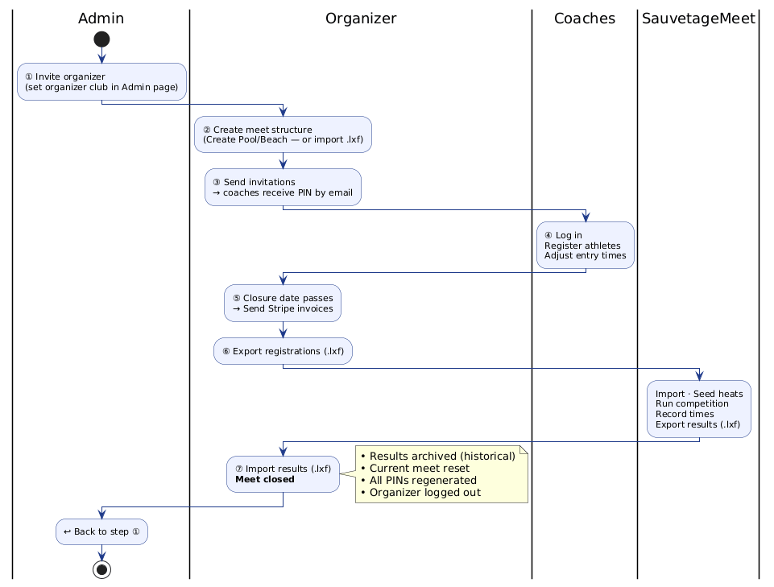

# SauvetageTeam — Administrator Guide

## Overview

The administrator is responsible for full database backup/restore, managing clubs and athletes, and maintaining data between seasons. This role has access to **all tabs** in the application (including the Organizer tabs).

---

## Complete Meet Lifecycle

The admin's role is primarily at **steps ① and ⑦**: inviting the organizer at the start, and being ready to invite the next organizer once the meet closes.

---

## Login

1. Open the SauvetageTeam app in a browser
2. Enter the **Admin PIN** (configured by the host)
3. Click **Login**

---

## Admin Tab — Key Actions

### Database Backup

The Admin page provides full backup and restore capabilities for the database.

#### Create Backup

1. Click **Create Backup** — a snapshot of the current database is stored on the server
2. The backup appears in the **Backup List** below

#### Restore (.sql)

1. Click **Restore (.sql)**
2. Select a `.sql` backup file to upload
3. The app wipes the current database and restores all data from the file

> **Warning**: This replaces ALL data in the database. Clubs get new PINs assigned automatically.

#### Auto-Backup Configuration

1. In the **Auto-Backup** section, set the **interval** (in days) between automatic backups
2. Set the **maximum copies** to keep — older backups are deleted automatically
3. Click **Save**

#### Backup List

The backup list displays all stored backups (manual and automatic):
- Click **Download** to save a backup file locally
- Click **Delete** to remove a backup from the server

### Designate the Organizer

1. In the **Set Meet Organizer** section, select the organizer club from the dropdown
2. Click **Save** — the designated club can now log in with the "organizer" role

### Manage Clubs

- Verify codes, names, and emails for each club
- Add or remove clubs as needed
- **Configure each club's email address** — required for sending invitations

### Configure Gemini API Keys

1. In the **Gemini API Keys** section, enter the free and/or paid key
2. Click **Save** — these keys travel with the `.smb` export to SauvetageMeet

### Change Admin PIN

1. In the **Change Admin PIN** section, enter the new PIN and confirm

---

## Organizer Pages (Admin has full access)

The admin has access to all organizer capabilities:
- Upload meet structure (.lxf)
- Upload entries/results (.lxf)
- Export registration bundle (.zip)
- Send invitations
- Create new pool/beach meet (from the Invitation page: **Create Pool** / **Create Beach** buttons)

See the [Organizer Guide](team-organizer) for details on these workflows.

---

## Data Management Tab

### Export Entries (.lxf)

1. Navigate to the **Data Management** tab
2. Click **Download entries (.lxf)** — use as the seed for the next meet

### Merge Duplicate Clubs

1. In the **Merge Clubs** section, select the **source club** (to eliminate) and the **target club** (to keep)
2. Click **Merge** — all athletes are re-parented to the target club

### Merge Diverging Styles

1. In the **Merge Styles** section, select the **source UID** (to eliminate) and **target UID** (canonical)
2. A **preview popup** shows the affected records before executing
3. Confirm to proceed — best times are consolidated (fastest per pool size is kept)

---

## Task Summary

| Task | When | Section |
|------|------|---------|
| Designate organizer | Before each meet | Admin |
| Configure club emails | Before invitations | Admin |
| Configure Gemini keys | Before competition | Admin |
| Create backup | After any major change | Admin |
| Configure auto-backup | Once (set interval + max copies) | Admin |
| Export entries (.lxf) | After updating times | Data Management |
| Merge clubs/styles | After multiple imports | Data Management |
| *(After meet closes)* Invite next organizer | After organizer imports results | Admin |
