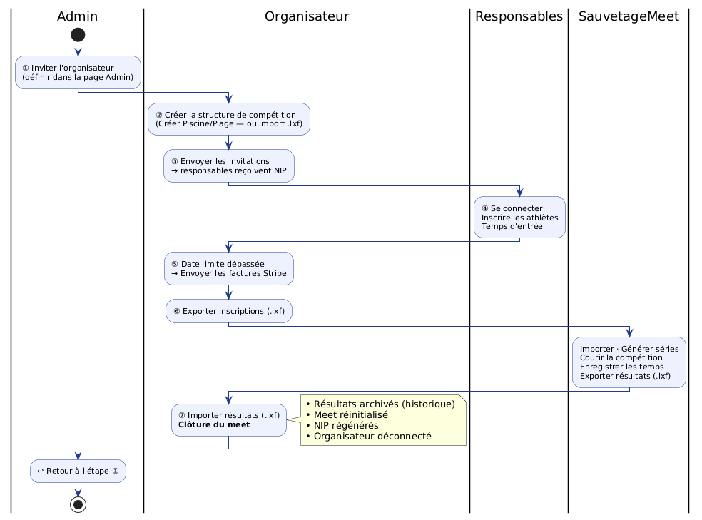
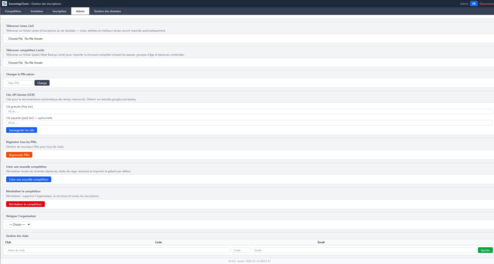

# SauvetageTeam — Guide de l'administrateur

## Vue d'ensemble

L'administrateur est responsable de la sauvegarde/restauration complète de la base de données, de la gestion des clubs et athlètes, et de la maintenance des données entre les saisons. Ce rôle a accès à **tous les onglets** de l'application : Compétition, Invitation, Inscriptions individuelles, Inscriptions relais, SERC et Admin.

---

## Cycle complet de compétition

Le rôle de l'administrateur se situe principalement aux **étapes ① et ⑦** : inviter l'organisateur au début, puis être prêt à inviter le prochain organisateur une fois le meet clôturé.

---

## Connexion

1. Ouvrir l'application SauvetageTeam dans un navigateur
2. Entrer le **NIP administrateur** (configuré par l'hébergeur)
3. Cliquer **Connexion**

---

## Onglet Admin — Actions principales

### Sauvegarde de la base de données

La page Admin offre des fonctionnalités complètes de sauvegarde et restauration de la base de données.

#### Créer une sauvegarde

1. Cliquer **Créer une sauvegarde** — un instantané de la base de données est stocké sur le serveur
2. La sauvegarde apparaît dans la **Liste des sauvegardes** ci-dessous

#### Restaurer (.sql)

1. Cliquer **Restaurer (.sql)**
2. Sélectionner un fichier de sauvegarde `.sql` à téléverser
3. L'application efface la base de données actuelle et restaure toutes les données du fichier

> **Attention** : Ceci remplace TOUTES les données. Les clubs reçoivent de nouveaux NIP automatiquement.

#### Configuration de la sauvegarde automatique

1. Dans la section **Sauvegarde automatique**, définir l'**intervalle** (en jours) entre les sauvegardes
2. Définir le **nombre maximum de copies** à conserver — les plus anciennes sont supprimées automatiquement
3. Cliquer **Enregistrer**

#### Liste des sauvegardes

La liste des sauvegardes affiche toutes les sauvegardes stockées (manuelles et automatiques) :
- Cliquer **Télécharger** pour sauvegarder un fichier localement
- Cliquer **Supprimer** pour retirer une sauvegarde du serveur

### Désigner l'organisateur

1. Dans la section **Désigner l'organisateur**, sélectionner le club organisateur
2. Cliquer **Enregistrer** — le club désigné pourra se connecter avec le rôle « organisateur »

### Gérer les clubs

- Vérifier les codes, noms et courriels de chaque club
- Ajouter ou supprimer des clubs au besoin
- **Configurer l'adresse courriel** de chaque club — nécessaire pour les invitations

### Configurer les clés API Gemini

1. Dans la section **Clés API Gemini**, entrer la clé gratuite et/ou payante
2. Cliquer **Enregistrer** — ces clés voyagent avec l'export `.smb` vers SauvetageMeet

### Changer le NIP admin

1. Dans la section **Changer le NIP admin**, entrer le nouveau NIP et confirmer

---

## Pages Organisateur (l'admin a accès complet)

L'admin a accès à toutes les fonctionnalités de l'organisateur :
- Téléverser la structure de la compétition (.lxf)
- Téléverser les inscriptions/résultats (.lxf)
- Exporter le bundle d'inscriptions (.zip)
- Envoyer les invitations
- Créer un nouveau meet piscine/plage (depuis la page Invitation : boutons **Créer Piscine** / **Créer Plage**)
- Configuration et pointage SERC (Simulated Emergency Response Competition)

Voir le [Guide de l'organisateur](team-organizer) pour les détails.

---

## Compétitions historiques

La section **Compétitions historiques** permet d'importer les résultats de compétitions passées. Ces résultats sont utilisés pour calculer les meilleurs temps des athlètes pour les futurs meets.

### Importer Team.mdb (ancien format)

1. Cliquer **Importer Team.mdb** et sélectionner la base Access existante
2. Toutes les compétitions, membres et résultats sont importés

### Importer résultats .smb

1. Cliquer **Importer résultats .smb** et sélectionner un fichier de sauvegarde SauvetageMeet
2. Le nom du meet, les athlètes et les résultats sont importés

### Importer résultats .lxf

1. Cliquer **Importer résultats .lxf** et sélectionner un fichier Lenex de résultats
2. Si un meet en double est détecté, vous pouvez forcer l'importation

### Gérer les compétitions historiques

- Le tableau affiche toutes les compétitions importées avec leur date, lieu et nombre de résultats
- Cliquer **✕** pour supprimer une compétition historique (irréversible)

---

## Résumé des tâches

| Tâche | Quand | Section |
|-------|-------|---------|
| Désigner l'organisateur | Avant chaque meet | Admin |
| Configurer les courriels des clubs | Avant les invitations | Admin |
| Configurer les clés Gemini | Avant la compétition | Admin |
| Créer une sauvegarde | Après tout changement majeur | Admin |
| Configurer la sauvegarde auto | Une fois (intervalle + copies max) | Admin |
| Importer résultats historiques | Après réception des résultats d'un ancien meet | Admin |
| *(Après clôture)* Inviter le prochain organisateur | Après import des résultats | Admin |
