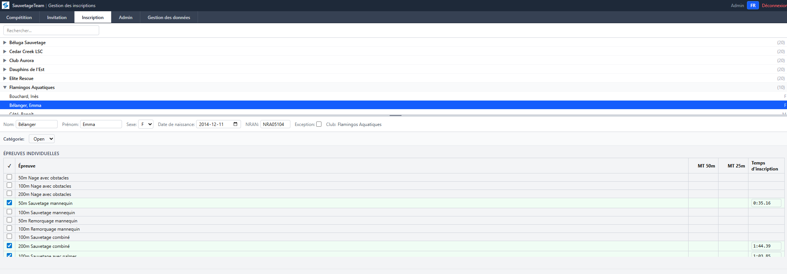

# SauvetageTeam — Coach Guide

## Overview

The club coach (team manager) registers athletes for the upcoming competition. This role has access to the **Registration** tab only, limited to their own club's athletes.

**Your role in the meet cycle:** You are notified at step ③ (invitation email with your club PIN). You act during step ④ (register athletes before the closure date). Once the competition ends and the organizer imports results, your PIN is regenerated — you'll need a new invitation for the next meet.

---

## Getting Your PIN

### Via Invitation Email

1. The organizer sends an invitation email to your club's registered address
2. Click the **secure link** in the email — it reveals your club's PIN (one-time use)
3. Note the PIN — you'll use it to log in

### Via Self-Invite

If you haven't received an invitation:
1. Go to the login page and click **Request an Invitation**
2. Select your club, confirm the email on file, click **Send Invitation**
3. Check your email for the secure link

---

## Login

1. Open the SauvetageTeam app in a browser
2. Enter your **club PIN**
3. Click **Login** — the title bar shows your club name

---

## Registration

### Athlete List

After login, you see your club's athletes in a cascade tree layout:
- Athletes grouped by **age category** and **gender**
- Each athlete shows their name, registration status, and number of events registered
- Use the **search bar** to find a specific athlete

### Register for Events

1. Click on an athlete's name to expand their registration panel
2. **Check the box** next to each event to register — uncheck to unregister
3. If eligible for multiple categories (15-18 / Open / Masters), select from the **category dropdown**

### Entry Times and Best Times

- **Best times** (50m and 25m pool) are displayed read-only next to each event
- The **entry time** is pre-filled from the best time matching the meet's pool size
- You can **adjust the entry time** if needed (e.g., expected improvement)

### Relay Events

1. Check the relay event to register your club
2. Click **Assign Members** to set relay positions (1st, 2nd, 3rd, 4th)
3. Positions can be left empty and filled later

---

## Entry Closure

- The **closure date** is set by the organizer
- After closure, the registration form becomes **read-only**
- You can still view your registrations but cannot modify them

---

## Best Times Public Page

A public page is available (no login required) to consult best times:
- From the login page, click **Consult Best Times**
- Search by athlete name or club

---

## Tips

- Register athletes as early as possible — don't wait for the deadline
- Verify entry times are reasonable
- If an athlete's best time seems wrong, contact the administrator
- Relay positions can be changed up until the closure date
- If you lose your PIN, use the self-invite flow to get a new secure link

---

## Quick Reference

| Action | How |
|--------|-----|
| Log in | Enter club PIN → Login |
| Register for an event | Click athlete → Check event box |
| Change category | Select from dropdown at top of panel |
| Adjust entry time | Click the time field, type new time |
| Assign relay members | Check relay event → Assign Members |
| View best times | Login page → Consult Best Times |
| Get a new PIN | Login page → Request an Invitation |
