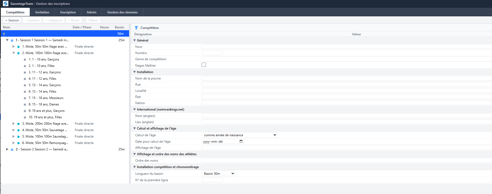

# SauvetageTeam — Guide de l'organisateur

## Vue d'ensemble

L'organisateur gère le cycle complet de la compétition : création de la structure, envoi des invitations, collecte des inscriptions, facturation et importation des résultats pour clôturer le meet. Ce rôle a accès aux onglets **Compétition**, **Invitation** et **Inscription**.

```
┌──────────────────────── CYCLE DE COMPÉTITION ─────────────────────────────┐
│                                                                             │
│  ① Admin          Inviter l'organisateur (définir dans la page Admin)     │
│        │                                                                    │
│        ▼                                                                    │
│  ② Organisateur   Créer la structure de compétition                       │
│                   (bouton Nouveau meet — ou import .lxf de SauvetageMeet)  │
│        │                                                                    │
│        ▼                                                                    │
│  ③ Organisateur   Envoyer les invitations → responsables reçoivent NIP    │
│        │                                                                    │
│        ▼                                                                    │
│  ④ Responsables   Se connecter · Inscrire les athlètes · Temps d'entrée   │
│        │                                                                    │
│        ▼                                                                    │
│  ⑤ Organisateur   Date limite dépassée → Envoyer les factures Stripe      │
│        │                                                                    │
│        ▼                                                                    │
│  ⑥ Organisateur   Exporter les inscriptions (.lxf)                        │
│   SauvetageMeet   Importer · Générer les séries · Courir la compétition   │
│                   Enregistrer les temps · Exporter les résultats (.lxf)   │
│        │                                                                    │
│        ▼                                                                    │
│  ⑦ Organisateur   Importer les résultats (.lxf)  ← clôture du meet       │
│                   → Résultats archivés comme meet historique               │
│                   → Meet actuel réinitialisé (épreuves et inscriptions)   │
│                   → NIP de tous les clubs régénérés                       │
│                   → Rôle d'organisateur effacé · Déconnexion              │
│        │                                                                    │
│        └──────────────────────────────────► ① Prochain cycle             │
│                                                                             │
└─────────────────────────────────────────────────────────────────────────────┘
```

---

## Connexion

1. Ouvrir l'application SauvetageTeam dans un navigateur
2. Entrer le **NIP du club organisateur** (fourni par l'administrateur)
3. Cliquer **Connexion**



---

## Onglet Compétition — Structure de la compétition

### Créer un nouveau meet

1. Dans la barre d'outils de l'onglet **Compétition**, cliquer **Nouveau meet piscine** ou **Nouveau meet plage**
2. Confirmer le dialogue — ceci efface la structure d'épreuves actuelle et charge le gabarit
3. L'arbre des épreuves se rafraîchit avec les épreuves standard du type choisi

> **Note** : Ceci ne réinitialise que la structure d'épreuves. Les clubs et athlètes sont préservés.

### Visualiser l'arbre des épreuves

L'onglet Compétition affiche la structure complète sous forme d'arbre :
- **Sessions** (matin, après-midi, etc.)
- **Épreuves** dans chaque session (50m Nage avec obstacles, 100m Sauvetage combiné, etc.)
- **Catégories d'âge** dans chaque épreuve

### Téléverser la structure de la compétition

1. Dans la barre d'outils, cliquer **Téléverser structure (.lxf)**
2. Sélectionner le fichier `.lxf` exporté depuis SauvetageMeet
3. L'application charge toutes les épreuves, la taille du bassin, le drapeau Masters et les tarifs

> **Important** : Téléverser une nouvelle structure remplace la structure actuelle. Toutes les inscriptions existantes seront supprimées.

### Résumé des frais

Après le téléversement d'une structure, la boîte **Résumé des frais** affiche :
- Frais au niveau de la compétition (par athlète, par club)
- Frais par épreuve (épreuves chronométrées)
- Devise

---

## Onglet Invitation — Gestion des invitations

### Fixer la date limite d'inscription

1. Naviguer vers l'onglet **Invitation**
2. Dans la section **Date limite d'inscription**, sélectionner la date et cliquer **Enregistrer**
3. Les responsables peuvent inscrire jusqu'à cette date ; après la clôture, le formulaire devient en lecture seule

### Envoyer les invitations

1. Dans la section **Invitations aux équipes**, sélectionner les clubs à inviter
2. Cliquer **Envoyer l'invitation**
3. Chaque responsable reçoit un courriel avec un lien sécurisé à usage unique pour récupérer son NIP

> **Note** : Les clubs doivent avoir une adresse courriel configurée dans la page Admin.

### Suivre le statut des invitations

La liste des invitations affiche :
- ✅ Invitation envoyée (avec date)
- 📧 Courriel en attente
- 🔗 Lien cliqué (NIP révélé)

### Auto-invitation (flux alternatif)

Les responsables peuvent demander leur propre invitation depuis la page de connexion :
1. Cliquer **Demander une invitation**
2. Sélectionner leur club, confirmer le courriel, cliquer **Envoyer l'invitation**

---

## Après la clôture — Exporter les inscriptions

1. Après la date limite, cliquer **Télécharger LXF** dans la barre d'outils de l'onglet Invitation
2. Importer le fichier `.lxf` dans SauvetageMeet : **Fichier → Importer un fichier LENEX**
3. Tous les athlètes, clubs et temps d'inscription sont chargés dans SauvetageMeet

---

## Après la clôture — Envoyer les factures (Stripe)

Si votre compte Stripe est connecté :

1. Sélectionner les clubs dans l'onglet Invitation (cases à cocher)
2. Cliquer **Envoyer la facture Stripe** — chaque club reçoit une facture pour ses frais d'inscription
3. Les clubs paient en ligne ; le statut de paiement est suivi dans Stripe

> **Note** : Connecter votre compte Stripe dans la barre d'outils de l'onglet Invitation avant le meet. Les tarifs sont configurés dans la structure de compétition.

---

## Onglet Inscription

L'organisateur peut inscrire des athlètes de n'importe quel club et modifier les inscriptions (même interface que les responsables, mais sans restriction de club). Voir le [Guide du responsable d'équipe](team-coach) pour les détails.

---

## Après la compétition — Importer les résultats (clôturer le meet)

Une fois la compétition terminée et les résultats exportés depuis SauvetageMeet :

1. Dans SauvetageMeet, utiliser **Fichier → Exporter les résultats LENEX…** pour sauvegarder un fichier `.lxf`
2. Dans SauvetageTeam (onglet Invitation), cliquer **Importer résultats**
3. Confirmer l'avertissement — cette action est **irréversible** et va :
   - Archiver les résultats comme meet historique (utilisé pour les futurs meilleurs temps)
   - Réinitialiser le meet actuel (inscriptions et structure d'épreuves effacées)
   - Régénérer les NIP de tous les clubs (les responsables devront se reconnecter)
   - Effacer le rôle d'organisateur et **vous déconnecter**
4. Après la déconnexion, l'administrateur peut inviter l'organisateur du prochain meet

> **Note pour l'admin** : Après l'import des résultats, le système est de retour à l'étape ①. Désigner le prochain organisateur dans la page Admin.

---

## Résumé du flux complet

| Étape | Action | Rôle | Outil |
|-------|--------|------|-------|
| ① | Inviter l'organisateur | Admin | SauvetageTeam |
| ② | Créer la structure de compétition | Organisateur | SauvetageTeam (ou SauvetageMeet → export) |
| ③ | Envoyer les invitations aux clubs | Organisateur | SauvetageTeam |
| ④ | Inscrire les athlètes | Responsables | SauvetageTeam |
| ⑤ | Envoyer les factures Stripe (collecter les frais) | Organisateur | SauvetageTeam |
| ⑥ | Exporter les inscriptions (.lxf) → Courir la compétition | Organisateur + SauvetageMeet | Les deux |
| ⑦ | Importer les résultats (.lxf) → meet clôturé | Organisateur | SauvetageTeam |
